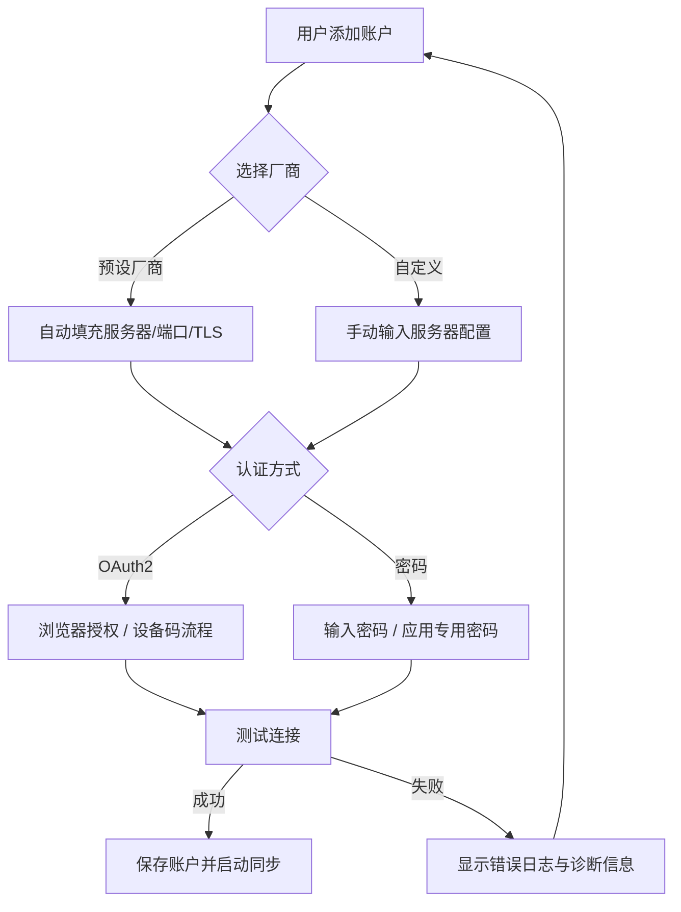

# AeroMail 产品需求文档（PRD）

## 1. 文档信息

| 项目 | 内容 |
|------|------|
| 产品名称 | AeroMail |
| 文档版本 | v1.0 |
| 编写日期 | 2026-06-17 |
| 技术栈 | Rust + Tauri v2 + Tokio + Vue 3 + TypeScript + Vite + Tailwind CSS + Shadcn UI |
| 数据存储 | SQLite (rusqlite) + Tantivy |
| 协议库 | async-imap + lettre + mailparse |
| 目标平台 | Linux (Wayland/Hyprland)、macOS、Windows |

---

## 2. 产品定位

AeroMail 是一款基于 Rust + Tauri v2 构建的全平台现代化邮件桌面客户端，采用"重后端、轻前端"架构。所有 IO 密集型（数据库、网络）和 CPU 密集型（邮件解析、搜索分词）任务由 Rust 后端处理，前端仅负责响应式渲染。

核心定位：
- **专业级生产力工具**：针对双 2K 显示器、Wayland (Hyprland) 环境优化
- **100% HTML 邮件完美渲染**：还原复杂商业排版邮件，自动拦截追踪像素
- **极致本地性能**：千万级邮件毫秒级全文检索，后台增量同步不断网

---

## 3. 目标用户与使用场景

### 3.1 目标用户画像

| 用户类型 | 特征 | 核心诉求 |
|----------|------|----------|
| 高级 Linux 用户 | 使用 CachyOS/Hyprland/Wayland，多显示器办公 | 原生 Wayland 渲染、字体清晰、无 XWayland 模糊 |
| 跨平台开发者 | 多邮箱账户（Gmail/Outlook/企业邮箱） | 统一收件箱、多账户隔离、快速搜索 |
| 效率办公者 | 日均处理 50+ 邮件，重视键盘操作 | 多窗口并行、富文本写信、草稿自动保存 |
| 隐私敏感用户 | 关注邮件追踪、数据本地存储 | 追踪像素拦截、本地加密缓存、无云端上传 |

### 3.2 使用场景

1. **日常收件**：后台自动同步多账户邮件，离线时仍可阅读已缓存邮件
2. **邮件搜索**：通过标题/正文/发件人关键词，在百万级邮件中秒级定位
3. **写信发信**：富文本编辑、Markdown 实时转换、附件拖拽、多草稿并行
4. **多任务并行**：双击邮件弹出独立窗口，边读邮件边写回复互不阻塞
5. **跨屏办公**：双 2K 显示器下窗口拖拽无撕裂，Fractional Scaling 字体清晰

---

## 4. 核心业务功能

### 4.1 多账户连接（Multi-Account）

支持标准 IMAP（收信/同步）与 SMTP（发信）协议，提供三种连接方式：

#### 4.1.1 预设国内外主流邮件厂商

| 厂商 | 协议 | 认证方式 | 预设配置 |
|------|------|----------|----------|
| Gmail | IMAP/SMTP | OAuth2 | 服务器地址、端口、TLS 自动填充 |
| Outlook / Microsoft 365 | IMAP/SMTP | OAuth2 | 服务器地址、端口、TLS 自动填充 |
| QQ 邮箱 | IMAP/SMTP | 传统密码 | 服务器地址、端口、TLS 自动填充 |
| 163 邮箱 | IMAP/SMTP | 传统密码 | 服务器地址、端口、TLS 自动填充 |
| 阿里云邮箱 | IMAP/SMTP | 传统密码 | 服务器地址、端口、TLS 自动填充 |
| 腾讯企业邮 | IMAP/SMTP | 传统密码 | 服务器地址、端口、TLS 自动填充 |
| 自定义 IMAP/SMTP | IMAP/SMTP | 密码/OAuth2 | 用户手动填写 |

#### 4.1.2 OAuth2 认证

- 支持 Gmail、Outlook 的 OAuth2 设备码/授权码流程
- 本地安全存储 access_token 与 refresh_token（使用系统 keyring 或加密 SQLite）
- Token 过期自动刷新，无需用户重复授权

#### 4.1.3 传统密码认证

- 支持 IMAP/SMTP 明文密码（不推荐，仅用于测试环境）
- 支持应用专用密码（App Password）
- 密码本地加密存储（AES-256-GCM），不解密不上传

#### 4.1.4 高级配置（TLS / 端口 / Socket）

| 配置项 | 选项 | 默认值 |
|--------|------|--------|
| IMAP 服务器地址 | 文本输入 | 根据预设自动填充 |
| IMAP 端口 | 数字输入 | 993 (TLS) / 143 (STARTTLS) |
| SMTP 服务器地址 | 文本输入 | 根据预设自动填充 |
| SMTP 端口 | 数字输入 | 465 (TLS) / 587 (STARTTLS) |
| TLS 模式 | `强制 TLS` / `STARTTLS` / `无加密` | 强制 TLS |
| 证书验证 | `系统 CA` / `自定义 CA 证书` / `跳过验证` | 系统 CA |
| 自定义 CA 证书 | 文件选择 (.pem/.crt) | 空 |
| Socket 连接超时 | 数字输入（秒） | 30 |
| Socket 读取超时 | 数字输入（秒） | 30 |
| 连接保活心跳 | 开关 | 开启 |

### 4.2 多线程本地同步引擎

- 每个邮件账户分配独立 Tokio Task，通过 `tokio::sync::mpsc` 与主进程通信
- 后台增量同步：仅同步新增/变更/删除的邮件，支持 UIDVALIDITY 校验
- 断网自动重连：指数退避重试，网络恢复后自动续传
- 离线阅读：已同步邮件本地缓存，断网时可正常浏览、搜索、阅读
- 同步状态实时反馈：前端显示每个账户的同步进度、上次同步时间、错误状态

### 4.3 100% HTML 邮件渲染

- 使用标准 `<iframe>` 承载 HTML 内容，设置 `sandbox="allow-same-origin"`
- **彻底禁用脚本执行**（`allow-scripts` 不开启），物理隔离 XSS
- 利用 `srcdoc` 属性直接注入 Rust 解析后的 HTML 字符串，达到原生级排版还原
- 自动拦截追踪像素：将 `` 替换为占位图，按需手动加载
- 纯文本/HTML 双模式切换：用户可一键切换查看原始纯文本内容
- 暗黑模式适配：锁死 `colorScheme: 'light'` 防止不支持暗黑的邮件排版错乱

### 4.4 千万级本地全文检索

- 搜索引擎：Tantivy（纯 Rust 类 Lucene 引擎）
- 索引内容：邮件标题、正文（去除 HTML 标签后的纯文本）、发件人地址/名称
- 性能目标：千万级邮件检索耗时 < 10ms
- 实时索引：邮件同步入库时同步写入 Tantivy 索引，无额外延迟
- 分词支持：英文空格分词 + 中文 jieba 分词（或 tantivy-jieba 插件）
- 搜索语法：支持关键词模糊匹配、短语搜索、发件人过滤

### 4.5 全功能写信编辑器

- 富文本编辑：基于 contentEditable 或 TipTap，支持字体、颜色、列表、链接、引用
- Markdown 实时转换：支持 Markdown 语法输入，实时预览或自动转换为富文本
- 附件拖拽上传：支持文件拖拽到编辑器区域，自动编码为 MIME 附件
- 草稿自动保存：每 30 秒自动保存草稿到本地 SQLite，意外关闭后可恢复
- 多草稿并行：支持同时编辑多封未发送邮件，独立窗口或标签页切换
- 发信队列：点击发送后进入 SMTP 异步队列，后台发送，失败可重试

### 4.6 多窗口独立操作

- 双击单封邮件可弹出独立读信窗口
- 点击"新窗口写信"可弹出独立写信窗口
- 各窗口独立进程/线程，互不阻塞
- 主窗口与独立窗口状态实时同步（如标记已读、星标、删除）
- 支持跨显示器拖拽，Wayland 下原生渲染无撕裂

---

## 5. 功能清单与优先级

### 5.1 账户与连接模块（Account）

| ID | 功能 | 优先级 | 说明 |
|----|------|--------|------|
| ACC-01 | 预设厂商快速配置 | P0 | Gmail/Outlook/QQ/163/阿里云/腾讯企业邮 |
| ACC-02 | OAuth2 授权流程 | P0 | 支持授权码与设备码模式 |
| ACC-03 | 传统密码认证 | P0 | 支持明文密码与应用专用密码 |
| ACC-04 | 高级配置（TLS/端口/Socket） | P0 | 自定义服务器、端口、TLS 模式、超时、CA 证书 |
| ACC-05 | 多账户并行管理 | P0 | 支持同时在线 5+ 账户，独立同步任务 |
| ACC-06 | 账户连接诊断日志 | P1 | 连接失败时展示详细 IMAP/SMTP 交互日志 |
| ACC-07 | 账户导入/导出配置 | P2 | 支持 JSON 格式备份账户配置（脱敏） |

### 5.2 同步与存储模块（Sync）

| ID | 功能 | 优先级 | 说明 |
|----|------|--------|------|
| SYNC-01 | 后台增量同步 | P0 | UID 增量同步，仅拉取变更 |
| SYNC-02 | 断网自动重连 | P0 | 指数退避，网络恢复后自动续传 |
| SYNC-03 | 离线阅读 | P0 | 已同步邮件本地缓存，无网可浏览 |
| SYNC-04 | 同步进度实时展示 | P0 | 前端显示进度条、已同步数量、错误状态 |
| SYNC-05 | 本地加密存储 | P0 | SQLite 加密，敏感字段 AES-256-GCM |
| SYNC-06 | 邮件附件本地缓存 | P1 | 大附件按需下载，本地 LRU 缓存 |
| SYNC-07 | 同步策略配置（频率/文件夹） | P1 | 可配置同步间隔、排除文件夹 |

### 5.3 邮件阅读模块（Reader）

| ID | 功能 | 优先级 | 说明 |
|----|------|--------|------|
| READ-01 | 100% HTML 渲染 | P0 | iframe + srcdoc + sandbox 安全隔离 |
| READ-02 | 追踪像素自动拦截 | P0 | 外部图片默认占位，手动加载 |
| READ-03 | 纯文本/HTML 切换 | P0 | 一键切换查看原始纯文本 |
| READ-04 | 暗黑模式适配 | P0 | 锁死 colorScheme 防止排版错乱 |
| READ-05 | 附件预览与下载 | P1 | 常见格式（PDF/图片）预览，一键下载 |
| READ-06 | 邮件标记（已读/未读/星标） | P0 | 本地状态同步回 IMAP 服务器 |
| READ-07 | 邮件移动/删除/归档 | P0 | 支持拖拽到文件夹，操作同步服务器 |

### 5.4 搜索模块（Search）

| ID | 功能 | 优先级 | 说明 |
|----|------|--------|------|
| SRCH-01 | 全文检索（标题/正文/发件人） | P0 | Tantivy 索引，千万级 < 10ms |
| SRCH-02 | 实时索引更新 | P0 | 同步入库即索引，无额外延迟 |
| SRCH-03 | 中文分词支持 | P0 | jieba 或 tantivy-jieba 分词 |
| SRCH-04 | 高级搜索过滤 | P1 | 按日期范围、账户、文件夹、已读状态过滤 |
| SRCH-05 | 搜索结果高亮 | P1 | 关键词在标题和正文中高亮显示 |

### 5.5 写信模块（Composer）

| ID | 功能 | 优先级 | 说明 |
|----|------|--------|------|
| COMP-01 | 富文本编辑 | P0 | 字体、颜色、列表、链接、引用 |
| COMP-02 | Markdown 实时转换 | P0 | 支持 Markdown 输入，实时预览或转换 |
| COMP-03 | 附件拖拽上传 | P0 | 文件拖拽到编辑器，自动编码为 MIME |
| COMP-04 | 草稿自动保存 | P0 | 每 30 秒自动保存，意外关闭可恢复 |
| COMP-05 | 多草稿并行 | P1 | 同时编辑多封未发送邮件 |
| COMP-06 | 发信队列与失败重试 | P0 | 异步 SMTP 发送，失败可重试 |
| COMP-07 | 联系人自动补全 | P1 | 从已收邮件中提取地址，输入时自动补全 |

### 5.6 界面与窗口模块（UI）

| ID | 功能 | 优先级 | 说明 |
|----|------|--------|------|
| UI-01 | 现代自适应三栏布局 | P0 | 左栏导航、中栏列表、右栏详情 |
| UI-02 | 深度暗黑模式 | P0 | 系统级暗黑模式跟随，独立切换 |
| UI-03 | 毛玻璃质感 | P1 | macOS 磨砂/Windows Mica 效果 |
| UI-04 | 骨架屏加载动效 | P1 | 邮件列表和详情加载时的 Skeleton 动画 |
| UI-05 | 多窗口独立操作 | P0 | 双击弹出独立读信/写信窗口，互不阻塞 |
| UI-06 | 原生 Wayland 渲染 | P0 | 严禁 XWayland，支持 Fractional Scaling |
| UI-07 | 系统托盘与通知 | P0 | Wayland 原生托盘，新邮件系统级通知 |

---

## 6. 非功能性需求

### 6.1 性能目标

| 指标 | 目标值 | 测试条件 |
|------|--------|----------|
| 邮件列表加载 | < 5ms | SQLite 百万数据，分页 50 条 |
| 全文搜索响应 | < 10ms | Tantivy 千万级索引 |
| 应用冷启动 | < 500ms | 空载状态，本地缓存已存在 |
| 内存占用（空载） | ~30MB | 仅主进程，无邮件加载 |
| 单封邮件同步 | < 2s | 含附件的常规邮件 |
| 后台同步 CPU 占用 | < 5% | 增量同步期间 |

### 6.2 安全需求

- **XSS 隔离**：HTML 邮件渲染禁用 `allow-scripts`，仅允许 `allow-same-origin`
- **追踪拦截**：默认拦截所有外部 HTTP/HTTPS 图片加载，用户手动确认后放行
- **密码加密**：所有账户密码、Token 使用 AES-256-GCM 加密，密钥存储于系统 keyring
- **本地数据加密**：SQLite 数据库启用 SQLCipher 加密，索引文件无敏感内容可明文
- **CSP 策略**：前端 CSP 限制为 `default-src 'self'; img-src 'self' https: data:; style-src 'self' 'unsafe-inline';`

### 6.3 兼容性需求

- **Linux**：原生 Wayland 渲染，支持 GNOME/KDE/Hyprland/Sway
- **macOS**：支持 macOS 12+，原生菜单栏与通知中心
- **Windows**：支持 Windows 10+，原生 Mica/Acrylic 材质
- **显示器**：支持 HiDPI、Fractional Scaling（125%/150%/175%），双 2K 无撕裂

### 6.4 可靠性需求

- 断网环境下已同步邮件 100% 可阅读、可搜索
- 后台同步异常不影响前端 UI 响应
- 单账户同步失败不影响其他账户同步
- 应用崩溃后草稿不丢失（SQLite 持久化）

---

## 7. 验收标准

### 7.1 账户连接（ACC）

| ID | 验收标准 | 测试方法 |
|----|----------|----------|
| ACC-01 | 用户选择 Gmail 预设后，IMAP/SMTP 地址、端口、TLS 自动填充且不可手动修改（或高级模式可修改） | 界面点击测试 |
| ACC-02 | 用户选择 OAuth2 后，30 秒内完成授权并获取 access_token，Token 本地加密存储 | 抓包 + 本地存储验证 |
| ACC-03 | 用户输入错误密码后，3 秒内返回认证失败提示，并展示 IMAP 服务器返回的具体错误码 | 错误输入测试 |
| ACC-04 | 高级配置中修改 IMAP 端口为 143 并选择 STARTTLS，连接测试成功 | 自定义端口连接测试 |
| ACC-05 | 同时添加 5 个 Gmail 账户，全部同步任务独立运行，互不阻塞 | 多账户并发测试 |
| ACC-06 | 添加自定义 CA 证书后，连接自签名证书服务器成功，且证书验证通过 | 自签名服务器测试 |

### 7.2 同步与存储（SYNC）

| ID | 验收标准 | 测试方法 |
|----|----------|----------|
| SYNC-01 | 在 1000 封邮件的账户中，首次全量同步耗时 < 5 分钟，增量同步（新增 10 封）耗时 < 10 秒 | 计时测试 |
| SYNC-02 | 断开网络 30 秒后恢复，同步任务在 10 秒内自动重连并续传，无需手动操作 | 断网模拟测试 |
| SYNC-03 | 断网状态下，已同步邮件列表加载、搜索、阅读功能 100% 可用 | 飞行模式测试 |
| SYNC-04 | 同步过程中前端 UI 无卡顿，滚动邮件列表帧率保持 60fps | 性能监控测试 |
| SYNC-05 | 使用 DB 浏览器打开本地 SQLite 文件，敏感字段（密码、Token）为加密密文，无法直接读取 | 文件内容审计 |

### 7.3 邮件阅读（READ）

| ID | 验收标准 | 测试方法 |
|----|----------|----------|
| READ-01 | 加载包含复杂 CSS 布局的 HTML 邮件（如电商促销邮件），排版与浏览器渲染一致度 > 95% | 视觉对比测试 |
| READ-02 | 打开含追踪像素的邮件，网络抓包中无对外部域名的图片请求，iframe 内 img src 为占位图 | 抓包验证 |
| READ-03 | 点击"显示纯文本"后，3 秒内切换为纯文本视图，内容无乱码 | 功能切换测试 |
| READ-04 | 系统切换为暗黑模式后，HTML 邮件 iframe 内颜色方案锁定为 light，邮件背景保持白色 | 主题切换测试 |
| READ-05 | 标记邮件为已读后，IMAP 服务器上该邮件 UID 的 `\Seen` 标志同步设置 | 服务器状态验证 |

### 7.4 搜索（SRCH）

| ID | 验收标准 | 测试方法 |
|----|----------|----------|
| SRCH-01 | 在 100 万封邮件中搜索关键词"发票"，返回结果耗时 < 10ms，结果数量正确 | 压力测试 + 计时 |
| SRCH-02 | 新邮件同步入库后，立即搜索该邮件标题中的关键词，5 秒内可检索到 | 实时性测试 |
| SRCH-03 | 搜索中文关键词"会议纪要"，分词后同时匹配"会议"和"纪要"的邮件 | 中文分词测试 |
| SRCH-04 | 搜索结果按时间倒序排列，前 50 条高亮显示关键词 | 结果验证测试 |

### 7.5 写信（COMP）

| ID | 验收标准 | 测试方法 |
|----|----------|----------|
| COMP-01 | 在富文本编辑器中输入文字、设置加粗、插入链接，最终发送的邮件 HTML 与编辑器预览一致 | 端到端发送测试 |
| COMP-02 | 在 Markdown 模式下输入 `# 标题` 和 `**粗体**`，实时预览正确渲染为 HTML | 实时预览测试 |
| COMP-03 | 拖拽 5 个文件（总计 20MB）到编辑器，附件列表正确显示，发送后收件方可正常下载 | 附件发送测试 |
| COMP-04 | 写邮件过程中强制关闭应用，重新打开后草稿内容 100% 恢复，无数据丢失 | 崩溃恢复测试 |
| COMP-05 | 同时打开 3 个写信窗口，各窗口内容独立，互不影响 | 多窗口并发测试 |
| COMP-06 | SMTP 服务器临时不可用（5 分钟），发信进入队列，服务器恢复后自动重试发送成功 | 失败重试测试 |

### 7.6 界面与窗口（UI）

| ID | 验收标准 | 测试方法 |
|----|----------|----------|
| UI-01 | 窗口宽度从 1400px 缩小到 800px，三栏布局自动切换为两栏/单栏，无元素重叠 | 响应式测试 |
| UI-02 | 系统切换暗黑模式后，应用所有界面元素（除邮件 iframe）在 1 秒内完成主题切换 | 主题切换测试 |
| UI-03 | 双击邮件列表项，弹出独立读信窗口，主窗口与独立窗口可同时操作，状态实时同步 | 多窗口操作测试 |
| UI-04 | 在 Hyprland 双 2K 显示器下，应用窗口拖拽跨屏无撕裂，字体 Fractional Scaling 125% 清晰无模糊 | 真机显示测试 |
| UI-05 | 应用最小化后，系统托盘图标常驻，新邮件到达时弹出系统级通知（libnotify/swaync） | 托盘通知测试 |
| UI-06 | 应用空载运行时，`ps` 查看进程内存占用 < 50MB，CPU 占用 < 1% | 资源监控测试 |

---

## 8. 术语表

| 术语 | 定义 |
|------|------|
| AeroMail | 本项目代号，基于 Rust + Tauri v2 的现代化邮件桌面客户端 |
| IMAP | Internet Message Access Protocol，用于从邮件服务器接收和同步邮件 |
| SMTP | Simple Mail Transfer Protocol，用于向邮件服务器发送邮件 |
| OAuth2 | 开放授权协议，用于 Gmail、Outlook 等第三方账户的安全认证 |
| STARTTLS | 一种将明文连接升级为加密连接的协议机制，常用于 IMAP/SMTP |
| TLS | Transport Layer Security，传输层安全协议，用于加密网络通信 |
| MIME | Multipurpose Internet Mail Extensions，定义邮件内容格式（HTML、附件等）的标准 |
| Tantivy | 纯 Rust 编写的类 Lucene 全文搜索引擎，用于本地邮件索引 |
| Tokio | Rust 异步运行时，用于调度后台同步任务和发信任务 |
| Wayland | Linux 下一代显示服务器协议，替代 X11，支持原生渲染和 Fractional Scaling |
| XWayland | X11 兼容层，用于在 Wayland 上运行 X11 应用，本项目严禁使用 |
| Hyprland | 基于 Wayland 的动态平铺窗口管理器，目标用户的主要桌面环境 |
| 追踪像素 | 嵌入邮件中的 1x1 像素图片，用于统计邮件打开率，本项目默认拦截 |
| UIDVALIDITY | IMAP 协议中用于标识邮箱唯一性的标志，用于增量同步校验 |
| SQLCipher | SQLite 的加密扩展，用于本地数据库加密 |
| CSP | Content Security Policy，前端内容安全策略，限制资源加载来源 |
| Skeleton | 骨架屏，数据加载时的占位动画，提升 perceived performance |
| Fractional Scaling | 分数级缩放（如 125%、150%），Wayland 支持的高 DPI 显示技术 |
