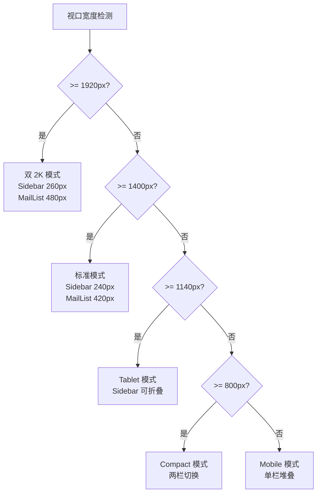
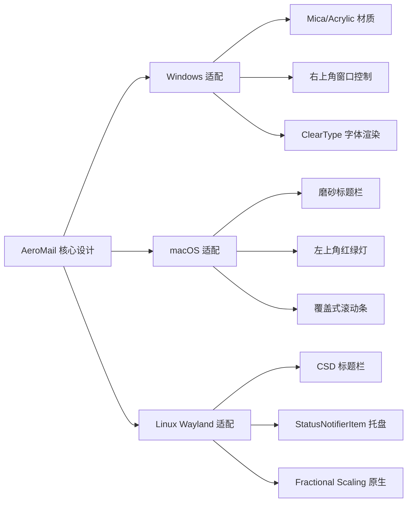

# AeroMail UI 设计系统

## 1. 设计定位

### 1.1 产品关键词

| 正向 | 反向 |
|------|------|
| Professional | 花哨 |
| Elegant | 拟物 |
| Fast | 重阴影 |
| Focused | 大圆角 |
| Premium | 大渐变 |

### 1.2 设计语言融合

AeroMail 采用以下设计体系的融合，而非传统邮件客户端风格：

| 来源 | 贡献 |
|------|------|
| Fluent 2 | 层级深度、圆角体系、材质质感 |
| Linear | 高信息密度、极简边框、深色优先 |
| Arc Browser | 侧边栏组织方式、工作区概念 |
| Notion | 排版呼吸感、内容聚焦 |

### 1.3 视觉特征

- 深色主题优先，浅色主题辅助
- 高信息密度，拒绝过度留白
- 三层视觉体系（Level 0/1/2），无多余层级
- 超轻边框（1px，低对比度），极少阴影
- Command Palette 作为中心交互入口
- 三栏工作区布局，支持多窗口生产力模式
- 双 2K 显示器优化
- Wayland 原生观感

---

## 2. 整体布局体系

### 2.1 标准模式

```text
┌───────────────────────────────────────────────────────────┐
│ Title Bar + Global Search                                │
├────────────┬────────────────┬─────────────────────────────┤
│ Sidebar    │ Mail List      │ Mail Viewer                 │
│            │                │                             │
│            │                │                             │
└────────────┴────────────────┴─────────────────────────────┘
```

| 区域 | 宽度 | 说明 |
|------|------|------|
| Sidebar | 240px | 固定宽度，可折叠 |
| Mail List | 420px | 固定宽度，可调整 |
| Mail Viewer | 剩余宽度 | 自适应，最小 480px |
| 总最小宽度 | 1140px | 低于此宽度切换为响应式布局 |

### 2.2 双 2K 优化模式

目标分辨率：2560 x 1440（双屏）或 3440 x 1440（Ultra Wide）。

当检测到视口宽度 >= 1920px 时，自动扩展：

| 区域 | 标准模式 | 双 2K 模式 |
|------|----------|------------|
| Sidebar | 240px | 260px |
| Mail List | 420px | 480px |
| Mail Viewer | 自适应 | 自适应，保证阅读宽度 >= 560px |

### 2.3 响应式断点

| 断点 | 宽度 | 布局行为 |
|------|------|----------|
| Desktop | >= 1400px | 三栏完整显示 |
| Tablet | 1140px - 1399px | Sidebar 可折叠，三栏保留 |
| Compact | 800px - 1139px | 两栏：Sidebar + Mail List，Viewer 全屏覆盖 |
| Mobile | < 800px | 单栏：仅 Mail List，Viewer 全屏覆盖 |

### 2.4 布局结构图



---

## 3. 视觉层级系统

整个应用仅保留三层深度，避免边框、卡片、阴影过度堆砌。

| 层级 | 用途 | 色值（Dark） | 色值（Light） |
|------|------|--------------|---------------|
| Level 0 | App Background | #0B0F14 | #F8FAFC |
| Level 1 | Panel（侧边栏、列表区） | #121821 | #FFFFFF |
| Level 2 | Card（邮件卡片、详情卡片） | #1A2230 | #F1F5F9 |

### 3.1 层级应用规则

- 同一层级内元素不使用阴影区分，依靠边框和背景色差异
- Level 2 卡片 hover 时背景色微调，不使用阴影抬升
- 禁止纯黑（#000000）作为背景色，防止视觉疲劳
- 层级过渡使用 1px 边框，不用阴影分隔

---

## 4. 颜色系统

### 4.1 Dark Theme（主推）

```css
--background: #0B0F14;
--panel: #121821;
--card: #1A2230;

--border: #2A3342;
--border-hover: #3A4659;

--primary: #4D8DFF;
--primary-hover: #6BA3FF;
--primary-active: #3576E8;

--success: #12B76A;
--warning: #F79009;
--danger: #F04438;
--info: #4D8DFF;

--text: #F8FAFC;
--text-secondary: #CBD5E1;
--muted: #94A3B8;
--disabled: #64748B;

--overlay: rgba(0, 0, 0, 0.6);
--glass: rgba(18, 24, 33, 0.85);
```

### 4.2 Light Theme

```css
--background: #F8FAFC;
--panel: #FFFFFF;
--card: #F1F5F9;

--border: #E2E8F0;
--border-hover: #CBD5E1;

--primary: #2563EB;
--primary-hover: #3B82F6;
--primary-active: #1D4ED8;

--success: #10B981;
--warning: #F59E0B;
--danger: #EF4444;
--info: #2563EB;

--text: #0F172A;
--text-secondary: #475569;
--muted: #64748B;
--disabled: #94A3B8;

--overlay: rgba(0, 0, 0, 0.4);
--glass: rgba(255, 255, 255, 0.85);
```

### 4.3 语义色使用规范

| 场景 | 色值 | 示例 |
|------|------|------|
| 新邮件指示点 | #4D8DFF | 左侧 3px 竖条 |
| 同步成功 | #12B76A | 状态图标 |
| 同步警告 | #F79009 | 账户异常提示 |
| 删除/错误 | #F04438 | 删除按钮、错误提示 |
| 未读计数徽章 | #4D8DFF | 数字徽章背景 |
| 星标 | #F79009 | 星形图标填充 |

### 4.4 透明度层级

| 透明度 | 用途 |
|--------|------|
| 100% | 主背景、面板、卡片 |
| 85% | 毛玻璃面板（glass） |
| 60% | 遮罩层（overlay） |
| 40% | 禁用状态文字 |
| 20% | 分割线、hover 背景 |
| 10% | 极弱背景强调 |

---

## 5. 字体系统

### 5.1 字体栈

| 平台 | 字体 | 用途 |
|------|------|------|
| Linux | Inter | 西文正文、数字、代码 |
| 中文 | MiSans / HarmonyOS Sans | 中文正文、标题 |
| 全局 fallback | system-ui, -apple-system, sans-serif | 兜底 |

字体栈定义：

```css
--font-sans: 'Inter', 'MiSans', 'HarmonyOS Sans', system-ui, -apple-system, sans-serif;
--font-mono: 'JetBrains Mono', 'Fira Code', 'SF Mono', monospace;
```

### 5.2 字体层级

| 层级 | 字号 | 字重 | 行高 | 字间距 | 用途 |
|------|------|------|------|--------|------|
| Title | 24px | 600 | 32px | -0.02em | 邮件详情标题 |
| H1 | 20px | 600 | 28px | -0.01em | 模块标题、账户名 |
| H2 | 18px | 500 | 26px | 0 | 面板标题、分类标题 |
| Body | 14px | 400 | 22px | 0 | 正文、邮件列表摘要 |
| Caption | 12px | 400 | 18px | 0.01em | 时间戳、元信息、标签 |
| Tiny | 11px | 500 | 16px | 0.02em | 徽章、状态文字 |

### 5.3 字体渲染

- Linux Wayland：启用 subpixel 抗锯齿，hinting 设置为 slight
- macOS：使用系统原生字体渲染，-webkit-font-smoothing: antialiased
- Windows：ClearType 优化，字体加载优先使用 woff2

---

## 6. 组件规范

### 6.1 Sidebar

#### 结构

```text
┌──────────────────────┐
│ AeroMail             │  ← 品牌区，高度 48px
│                      │
│ ✉ New Mail           │  ← 主操作按钮，高度 40px
│                      │
│ 收件箱      128      │  ← 邮件文件夹，高度 36px
│ 星标邮件      12      │
│ 已发送              │
│ 草稿          3      │
│ 已归档             │
│ 垃圾邮件            │
│                      │
├──────────────────────┤  ← 分割线
│ Gmail                │  ← 账户区，高度 36px
│ Work                 │
│ Outlook              │
├──────────────────────┤
│ 附件中心             │  ← 功能区，高度 36px
│ 设置                 │
└──────────────────────┘
```

#### 尺寸规范

| 元素 | 尺寸 |
|------|------|
| 宽度 | 240px（标准）/ 260px（双 2K） |
| 品牌区高度 | 48px |
| 主操作按钮 | 40px 高，12px 圆角，全宽减 16px 边距 |
| 文件夹项高度 | 36px |
| 图标尺寸 | 16px x 16px |
| 文字与图标间距 | 12px |
| 右侧计数徽章 | 高度 18px，圆角 9px，最小宽度 18px |
| 内边距 | 12px 上下，16px 左右 |

#### 交互

- 文件夹项 hover：背景色从 transparent 过渡到 rgba(255,255,255,0.05)（Dark），150ms ease-out
- 当前选中项：左侧 3px 竖条指示器（#4D8DFF），背景色 #1A2230
- 账户项：显示账户头像（32px 圆形）或首字母占位
- 点击账户项展开/折叠该账户文件夹列表

---

### 6.2 邮件列表 Compact Card

#### 结构

```text
┌──────────────────────────────┐
│ ● GitHub             14:22   │  ← 发件人 + 时间
│                              │
│ Security Alert              │  ← 主题
│                              │
│ New login detected...        │  ← 摘要
│                              │
│ 📎 ⭐                         │  ← 附件/星标图标
└──────────────────────────────┘
```

#### 尺寸规范

| 元素 | 尺寸 |
|------|------|
| 卡片高度 | 72px |
| 内边距 | 12px 16px |
| 发件人文字 | 14px，字重 500 |
| 主题文字 | 14px，字重 400 |
| 摘要文字 | 12px，字重 400，颜色 --muted |
| 时间戳 | 12px，字重 400，颜色 --muted |
| 未读指示点 | 6px 圆形，#4D8DFF，左侧外边距 8px |
| 卡片间距 | 0px（无缝列表） |
| 分割线 | 1px，--border，底部 |

#### Hover Actions

鼠标悬停时，右侧显示快捷操作按钮组：

| 按钮 | 图标 | 操作 |
|------|------|------|
| 归档 | Archive | 立即归档 |
| 删除 | Trash | 移入垃圾邮件 |
| 已读 | MailOpen | 标记已读/未读 |
| 星标 | Star | 切换星标状态 |

- 按钮组尺寸：32px x 32px 图标按钮
- 出现时机：hover 150ms 后淡入
- 原时间戳在 hover 时隐藏，替换为操作按钮组

#### 选中状态

- 背景色：#1A2230（Level 2）
- 左侧 3px 竖条：#4D8DFF
- 发件人、主题字重保持 500

---

### 6.3 邮件详情页 Header

#### 结构

```text
┌─────────────────────────────┐
│ Subject                     │  ← 标题区
├─────────────────────────────┤
│ [Avatar] GitHub             │  ← 发件人信息
│ noreply@github.com          │
│                             │
│ Today 14:22                 │  ← 时间
├─────────────────────────────┤
│ Reply  Forward  Archive  Del│  ← 操作按钮
└─────────────────────────────┘
```

#### 尺寸规范

| 元素 | 尺寸 |
|------|------|
| 标题区高度 | 56px |
| 标题字号 | 24px，字重 600，单行截断 |
| 发件人头像 | 40px 圆形 |
| 发件人名称 | 16px，字重 500 |
| 发件人地址 | 12px，字重 400，--muted |
| 时间戳 | 14px，字重 400，--muted |
| 操作按钮 | 36px x 36px 图标按钮，8px 圆角 |
| 按钮间距 | 8px |
| 内边距 | 16px 24px |

#### 操作按钮

| 按钮 | 图标 | 快捷键 |
|------|------|--------|
| 回复 | Reply | R |
| 转发 | Forward | F |
| 归档 | Archive | A |
| 删除 | Trash | Delete |
| 更多 | MoreVertical | - |

---

### 6.4 Compose Workspace

#### 结构

```text
┌──────────────────────────────┐
│ To                           │  ← 收件人，高度 44px
│ CC                           │  ← 抄送，高度 44px
│ Subject                      │  ← 主题，高度 44px
├──────────────────────────────┤
│ B  I  U  Link  Quote  List   │  ← 工具栏，高度 40px
├──────────────────────────────┤
│                              │
│ Editor                       │  ← 编辑区，自适应
│                              │
├──────────────────────────────┤
│ [file1.pdf] [image.png]     │  ← 附件区，高度 48px
├──────────────────────────────┤
│ Send      Save Draft         │  ← 底部操作，高度 56px
└──────────────────────────────┘
```

#### 尺寸规范

| 元素 | 尺寸 |
|------|------|
| 输入框高度 | 44px |
| 输入框内边距 | 12px 16px |
| 输入框边框 | 1px，--border，聚焦时 --primary |
| 工具栏高度 | 40px |
| 工具栏按钮 | 32px x 32px |
| 编辑区最小高度 | 200px |
| 附件项高度 | 32px，圆角 6px，背景 --card |
| 底部操作栏高度 | 56px |
| 发送按钮 | 高度 36px，圆角 8px，背景 --primary |
| 保存草稿按钮 | 高度 36px，圆角 8px，ghost 样式 |

#### 模式切换

编辑区支持 Rich Text / Markdown 切换：

- 切换控件位于工具栏右侧
- 切换时编辑区内容实时转换，无弹窗
- Markdown 模式下工具栏简化为预览/编辑切换

---

### 6.5 Command Palette

#### 结构

```text
┌───────────────────────────┐
│ ⌘ Search mail...          │  ← 输入框
├───────────────────────────┤
│ GitHub Security Alert       │  ← 结果项
│ Invoice May 2026          │
│ Meeting Notes             │
└───────────────────────────┘
```

#### 尺寸规范

| 元素 | 尺寸 |
|------|------|
| 容器宽度 | 560px |
| 容器最大高度 | 400px |
| 圆角 | 12px |
| 阴影 | 0 16px 48px rgba(0,0,0,0.4) |
| 输入框高度 | 56px |
| 输入框字号 | 16px |
| 结果项高度 | 48px |
| 结果项内边距 | 12px 16px |
| 快捷键标签 | 12px，背景 --card，圆角 4px |

#### 交互

- 触发方式：Ctrl/Cmd + K 或点击顶部搜索栏
- 打开动画：250ms，从顶部淡入 + 轻微下移
- 关闭动画：150ms，淡出
- 结果项 hover：背景 --card
- 选中项：背景 --card，左侧 3px 竖条 --primary
- 支持键盘上下导航、Enter 确认、Esc 关闭

---

### 6.6 Status Bar（新增）

#### 功能定位

Status Bar 位于主窗口底部，提供全局状态信息，替代弹窗式提示，减少视觉干扰。

#### 结构

```text
┌───────────────────────────────────────────────────────────┐
│ ● 同步中...  3/5 账户  │  128 封未读  │  最后同步: 2分钟前  │
└───────────────────────────────────────────────────────────┘
```

#### 尺寸规范

| 元素 | 尺寸 |
|------|------|
| 高度 | 28px |
| 背景色 | --panel（#121821） |
| 文字 | 11px，字重 500，--muted |
| 内边距 | 0px 16px |
| 分割线 | 1px 竖线，--border，分隔信息区块 |

#### 信息区块

| 区块 | 内容 | 示例 |
|------|------|------|
| 同步状态 | 同步动画图标 + 状态文字 | "同步中... 3/5 账户" |
| 邮件统计 | 未读邮件总数 | "128 封未读" |
| 最后同步 | 相对时间 | "最后同步: 2分钟前" |
| 网络状态 | 在线/离线指示 | "在线" / "离线" |
| 版本信息 | 当前版本号 | "v1.0.0" |

#### 交互

- 点击同步状态：展开同步详情面板（各账户同步进度）
- 点击未读统计：聚焦到收件箱
- 离线状态：文字变为 --warning，图标变为警告样式
- 状态变更：文字颜色过渡 150ms

---

### 6.7 Toast 提示（新增）

#### 功能定位

Toast 用于非阻塞式操作反馈，替代 alert/confirm，保持用户当前工作流不中断。

#### 结构

```text
┌─────────────────────────────┐
│ ✓  邮件已发送               │
└─────────────────────────────┘

┌─────────────────────────────┐
│ ⚠  同步失败，正在重试...   │
│              [查看详情]      │
└─────────────────────────────┘
```

#### 尺寸规范

| 元素 | 尺寸 |
|------|------|
| 宽度 | 自适应，最小 280px，最大 400px |
| 高度 | 自适应，最小 44px |
| 圆角 | 8px |
| 内边距 | 12px 16px |
| 图标尺寸 | 16px x 16px |
| 文字 | 14px，字重 400 |
| 操作按钮 | 14px，字重 500，--primary |
| 阴影 | 0 4px 16px rgba(0,0,0,0.3) |

#### 位置与层级

- 默认位置：窗口右上角，距边缘 16px
- 堆叠方式：最多 3 个，垂直间距 8px，新 Toast 从顶部推入
- z-index：高于所有内容，低于 Command Palette

#### 类型与颜色

| 类型 | 图标 | 背景 | 左侧边框 |
|------|------|------|----------|
| Success | CheckCircle | #121821 | 3px #12B76A |
| Warning | AlertTriangle | #121821 | 3px #F79009 |
| Error | XCircle | #121821 | 3px #F04438 |
| Info | Info | #121821 | 3px #4D8DFF |

#### 行为

| 属性 | 值 |
|------|-----|
| 自动消失 | 默认 3 秒（Success/Info），5 秒（Warning/Error） |
| 悬停暂停 | 鼠标悬停时暂停倒计时 |
| 手动关闭 | 支持右侧关闭按钮（X），24px x 24px |
| 进入动画 | 从右侧滑入 + 淡入，200ms |
| 退出动画 | 向上滑出 + 淡出，150ms |
| 操作按钮 | 支持一个主操作，点击后 Toast 立即消失 |

---

## 7. 交互规范

### 7.1 多窗口模式

AeroMail 支持四种独立窗口类型：

| 窗口类型 | 用途 | 默认尺寸 | 特性 |
|----------|------|----------|------|
| Main Window | 邮件管理主界面 | 1400x900 | 完整三栏布局 |
| Reader Window | 独立阅读邮件 | 900x700 | 仅邮件详情，无侧边栏 |
| Compose Window | 独立写信 | 800x700 | 完整 Compose Workspace |
| Search Window | 全局搜索 | 600x500 | 仅 Command Palette + 结果 |

#### 多窗口协作规则

- 双击邮件列表项：弹出 Reader Window
- 点击"新窗口写信"：弹出 Compose Window
- 各窗口状态实时同步：标记已读、星标、删除操作在所有窗口即时反映
- 主窗口关闭时：其他窗口保持运行（除非用户设置关联退出）
- 跨显示器拖拽：支持在双 2K 显示器间自由移动，Wayland 下原生渲染无撕裂

#### 双屏工作流

```text
左屏: Main Window（Inbox 邮件列表）
右屏: Reader Window（当前阅读邮件）
```

### 7.2 Reading Mode

#### 触发方式

- 快捷键：Ctrl/Cmd + Shift + R
- 菜单：View -> Reading Mode
- 按钮：邮件详情页 Header 右侧"阅读模式"图标按钮

#### 行为

- 隐藏 Sidebar 和 Mail List
- Mail Viewer 扩展至全屏宽度
- 保留 Header（标题、发件人、操作按钮）
- 退出方式：Esc 键、再次点击阅读模式按钮、点击返回按钮

#### 适用场景

- Newsletter 长文阅读
- 技术周报
- 复杂排版邮件
- 需要专注的邮件内容

### 7.3 Hover Actions

#### 邮件列表 Hover

- 触发区域：整行卡片
- 延迟：无延迟，即时响应
- 显示内容：右侧操作按钮组（归档、删除、已读、星标）
- 隐藏内容：时间戳（被操作按钮组替换）

#### 附件 Hover

- 触发区域：附件项
- 显示内容：下载按钮、预览按钮
- 预览支持：PDF、图片直接预览，其他类型显示下载

#### 拖拽上传

- 触发区域：Compose Workspace 编辑区
- 拖拽进入：编辑区边框变为 2px dashed --primary，背景 rgba(77,141,255,0.1)
- 放置后：文件加入附件列表，自动编码为 MIME 附件
- 支持多文件同时拖拽

---

## 8. 动效规范

### 8.1 时间基准

| 场景 | 时长 | 缓动函数 |
|------|------|----------|
| Hover 反馈 | 150ms | ease-out |
| 面板展开/折叠 | 200ms | cubic-bezier(0.4, 0, 0.2, 1) |
| Modal/Dialog 打开 | 250ms | cubic-bezier(0.4, 0, 0.2, 1) |
| Modal/Dialog 关闭 | 150ms | ease-in |
| Toast 进入 | 200ms | ease-out |
| Toast 退出 | 150ms | ease-in |
| 页面切换 | 200ms | ease-in-out |
| Skeleton 闪烁 | 1500ms | linear（循环） |

### 8.2 具体应用

#### Hover 动效

- 背景色过渡：transparent -> rgba(255,255,255,0.05)，150ms ease-out
- 按钮缩放：scale(1) -> scale(1.02)，150ms ease-out
- 图标颜色：--muted -> --text，150ms ease-out

#### 面板动效

- Sidebar 折叠：宽度 240px -> 0px，opacity 1 -> 0，200ms
- Mail Viewer 扩展：宽度自适应，内容区域淡入 200ms
- Command Palette 打开：translateY(-8px) -> translateY(0)，opacity 0 -> 1，250ms

#### 加载动效

- Skeleton：背景色渐变扫描，#1A2230 -> #2A3342 -> #1A2230，1500ms 循环
- 列表加载：逐项淡入，每项延迟 30ms，最大延迟 300ms（前 10 项）
- 邮件内容加载：iframe srcdoc 注入后淡入 200ms

#### 状态切换

- 主题切换：所有颜色变量过渡 300ms ease-in-out
- 已读/未读：左侧指示点缩放 scale(0) -> scale(1) 或反向，150ms
- 星标切换：图标旋转 0deg -> 360deg，250ms，填充色过渡

---

## 9. 平台适配

### 9.1 Windows

| 适配项 | 规范 |
|--------|------|
| 标题栏 | 原生 Mica/Acrylic 材质，跟随系统主题 |
| 窗口控制 | 右上角最小化/最大化/关闭，遵循 Windows 11 圆角风格 |
| 字体渲染 | ClearType 优化，Inter 优先 |
| 滚动条 | 窄滚动条（8px），hover 时扩展至 12px |
| 快捷键 | Ctrl 为主修饰键，支持 Win 键全局快捷键 |
| 系统托盘 | 常驻任务栏托盘，右键菜单支持退出/显示主窗口 |
| 通知 | 使用 Windows 通知中心（WinRT） |
| 高对比度 | 支持系统高对比度模式，禁用毛玻璃效果 |

### 9.2 macOS

| 适配项 | 规范 |
|--------|------|
| 标题栏 | 原生磨砂效果，支持透明标题栏 |
| 窗口控制 | 左上角红绿灯，圆形按钮，16px 直径 |
| 字体渲染 | 系统原生抗锯齿，-webkit-font-smoothing: antialiased |
| 滚动条 | 覆盖式滚动条，默认隐藏，hover/滚动时显示 |
| 快捷键 | Cmd 为主修饰键，支持全局 Spotlight 式搜索 |
| 系统托盘 | 菜单栏图标，支持深色/浅色模式图标切换 |
| 通知 | 使用 NSUserNotificationCenter |
| 触控板 | 支持双指滑动返回、 pinch 缩放邮件内容 |
| 全屏 | 支持原生全屏模式，进入 Reading Mode 自动适配 |

### 9.3 Linux Wayland

| 适配项 | 规范 |
|--------|------|
| 标题栏 | 客户端绘制（CSD），Wayland 无原生标题栏概念；风格统一为 AeroMail 设计 |
| 窗口控制 | 右侧最小化/最大化/关闭，方形按钮，遵循 Fluent 2 风格 |
| 字体渲染 | Subpixel 抗锯齿，hinting: slight，Inter + MiSans |
| 滚动条 | 窄滚动条（8px），overlay 样式 |
| 快捷键 | Ctrl 为主修饰键，支持 Super 键全局快捷键 |
| 系统托盘 | 使用 StatusNotifierItem / libappindicator，兼容 GNOME/KDE/Hyprland/Sway |
| 通知 | 使用 libnotify / swaync / mako，支持操作按钮 |
| Fractional Scaling | 125%/150%/175% 缩放下字体清晰，无 XWayland 模糊 |
| 桌面环境 | GNOME：遵循 Adwaita 风格；KDE：遵循 Breeze 风格；Hyprland/Sway：极简风格 |
| 多显示器 | 支持跨显示器拖拽，Wayland 原生渲染无撕裂 |

### 9.4 平台视觉差异汇总



| 元素 | Windows | macOS | Linux Wayland |
|------|---------|-------|---------------|
| 标题栏材质 | Mica/Acrylic | 磨砂玻璃 | 纯色/自定义 CSD |
| 窗口按钮位置 | 右上 | 左上 | 右上（CSD） |
| 窗口按钮形状 | 方形 | 圆形 | 方形 |
| 字体抗锯齿 | ClearType | 系统原生 | Subpixel |
| 滚动条 | 固定窄条 | 覆盖隐藏 | 覆盖窄条 |
| 主修饰键 | Ctrl | Cmd | Ctrl |
| 通知 API | WinRT | NSUserNotification | libnotify/swaync |
| 托盘 API | 任务栏托盘 | 菜单栏图标 | StatusNotifierItem |
| 毛玻璃支持 | 原生 Mica | 原生 | 需自定义着色器 |
| 高对比度 | 系统高对比度模式 | 辅助功能设置 | 无障碍主题 |

---

## 10. 附录

### 10.1 设计令牌汇总

```css
/* 布局 */
--sidebar-width: 240px;
--sidebar-width-wide: 260px;
--maillist-width: 420px;
--maillist-width-wide: 480px;
--viewer-min-width: 480px;
--viewer-min-width-wide: 560px;

/* 圆角 */
--radius-sm: 4px;
--radius-md: 8px;
--radius-lg: 12px;
--radius-xl: 16px;

/* 间距 */
--space-1: 4px;
--space-2: 8px;
--space-3: 12px;
--space-4: 16px;
--space-5: 20px;
--space-6: 24px;
--space-8: 32px;
--space-10: 40px;
--space-12: 48px;

/* 阴影（极少使用） */
--shadow-modal: 0 16px 48px rgba(0, 0, 0, 0.4);
--shadow-toast: 0 4px 16px rgba(0, 0, 0, 0.3);
--shadow-card: 0 1px 3px rgba(0, 0, 0, 0.1);
```

### 10.2 图标规范

- 图标库：Lucide Vue（与 Shadcn UI 一致）
- 图标尺寸：16px（标准）、20px（工具栏）、24px（空状态/大图标）
- 图标描边宽度：1.5px（标准）、2px（强调）
- 图标颜色：继承当前文字颜色

### 10.3 无障碍

- 最小对比度：4.5:1（正文）、3:1（大文字/图标）
- 焦点环：2px solid --primary，offset 2px
- 所有交互元素支持键盘操作
- 支持屏幕阅读器 ARIA 标签
- 支持系统级高对比度/减少动效设置
