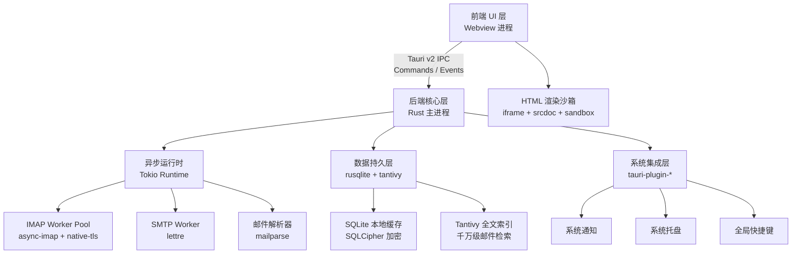
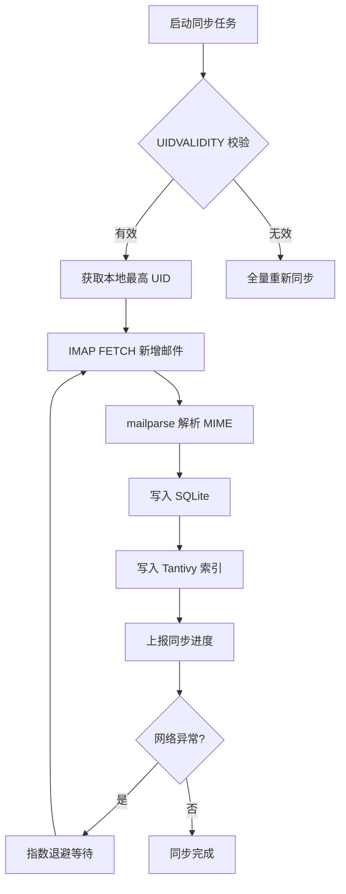
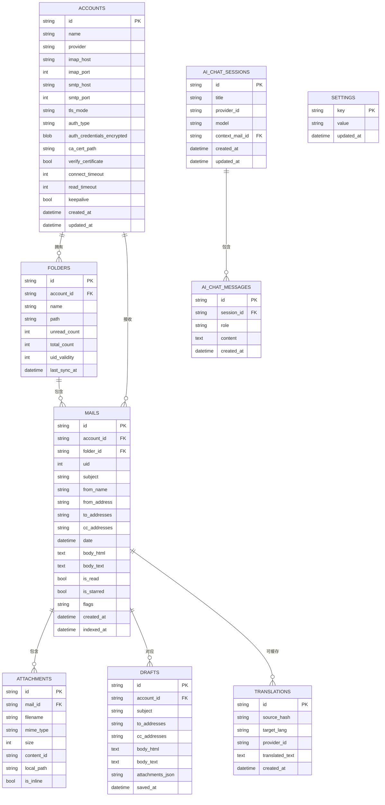

# AeroMail 技术实现方案

## 1. 技术栈选型

### 1.1 整体架构

AeroMail 采用"重后端、轻前端"架构，所有 IO 密集型（数据库、网络）和 CPU 密集型（邮件解析、搜索分词）任务由 Rust 后端处理，前端仅负责响应式渲染。

| 层级 | 技术选型 | 版本/说明 |
|------|----------|-----------|
| 桌面框架 | Tauri v2 | 跨平台 Webview 封装，IPC 通信 |
| 前端框架 | Vue 3 | Composition API + `<script setup>` |
| 前端构建 | Vite | 快速 HMR，生产优化 |
| 前端语言 | TypeScript | 严格模式，类型安全 |
| 样式系统 | Tailwind CSS | 原子化 CSS，设计令牌驱动 |
| UI 组件 | Shadcn UI (Vue) | 基于 Radix Vue 的无头组件 |
| 图标库 | Lucide Vue | 与 Shadcn UI 一致 |
| 后端语言 | Rust | 异步安全，内存安全 |
| 异步运行时 | Tokio | 多线程任务调度 |
| 数据库 | SQLite (rusqlite) | 嵌入式，本地加密缓存 |
| 全文检索 | Tantivy | 纯 Rust 类 Lucene 引擎 |
| 收信协议 | async-imap + native-tls | 异步 IMAP 客户端 |
| 发信协议 | lettre | SMTP 客户端 |
| 邮件解析 | mailparse | MIME 解析 |
| 通知 | tauri-plugin-notification | 跨平台系统通知 |
| 系统托盘 | tauri-plugin-tray | 跨平台托盘图标 |
| 全局快捷键 | tauri-plugin-global-shortcut | Command Palette 快捷键 |
| 国际化 | vue-i18n v10 | Vue 3 国际化，懒加载 locale |
| 后端 HTTP 客户端 | reqwest | 翻译 API / AI API 调用 |
| 哈希计算 | sha2 | 翻译缓存 source_hash |
| 异步流处理 | futures | AI 流式响应预留 |

### 1.2 选型理由

- **Tauri v2**：相比 Electron，内存占用降低 80%（空载 ~30MB），启动速度 < 500ms，原生支持跨平台打包（AppImage/DMG/MSIX）。
- **Vue 3 + Composition API**：响应式系统与 Rust 异步模型天然契合，`<script setup>` 减少样板代码，与 TypeScript 集成优于 Options API。
- **Tailwind CSS + Shadcn UI**：设计令牌（Design Token）可直接映射到 CSS 变量，实现 UI 设计系统的无缝落地。
- **Tokio + async-imap**：每个邮件账户分配独立 Tokio Task，通过 `tokio::sync::mpsc` 与主进程通信，后台同步绝不卡顿前台 UI。
- **Tantivy**：千万级邮件索引检索耗时 < 10ms，纯 Rust 实现无 FFI 开销。

---

## 2. 系统架构

### 2.1 架构拓扑图



### 2.2 进程与线程模型

| 组件 | 进程/线程 | 职责 |
|------|-----------|------|
| Webview 进程 | 独立进程（每窗口） | Vue 3 渲染、用户交互、DOM 操作 |
| Rust 主进程 | 单进程多线程 | IPC 路由、状态管理、插件调度 |
| Tokio Runtime | 多线程线程池 | 异步任务调度（IMAP/SMTP/解析） |
| IMAP Worker | 每账户 1 个 Tokio Task | 增量同步、断线重连、状态上报 |
| SMTP Worker | 全局 1 个 Tokio Task | 发信队列、失败重试 |
| Tantivy Indexer | 独立线程 | 索引写入、段合并 |

---

## 3. 核心模块设计

### 3.1 账户管理（Account Manager）

#### 3.1.1 模块职责

- 预设厂商配置自动填充
- OAuth2 授权流程（授权码/设备码）
- 传统密码认证（AES-256-GCM 加密存储）
- 高级配置（TLS/端口/Socket/CA 证书）
- 多账户并行管理（5+ 账户独立同步）

#### 3.1.2 数据结构

```rust
use serde::{Serialize, Deserialize};

#[derive(Debug, Clone, Serialize, Deserialize)]
pub struct AccountConfig {
    pub id: String,
    pub name: String,
    pub provider: MailProvider,
    pub imap: ServerConfig,
    pub smtp: ServerConfig,
    pub auth: AuthConfig,
    pub advanced: AdvancedConfig,
    pub sync_interval_secs: u64,
    pub excluded_folders: Vec<String>,
}

#[derive(Debug, Clone, Serialize, Deserialize)]
pub enum MailProvider {
    Gmail,
    Outlook,
    QQ,
    Netease163,
    Aliyun,
    TencentExmail,
    Custom,
}

#[derive(Debug, Clone, Serialize, Deserialize)]
pub struct ServerConfig {
    pub host: String,
    pub port: u16,
    pub tls_mode: TlsMode,
}

#[derive(Debug, Clone, Serialize, Deserialize)]
pub enum TlsMode {
    Required,
    StartTls,
    None,
}

#[derive(Debug, Clone, Serialize, Deserialize)]
pub enum AuthConfig {
    OAuth2 { access_token: String, refresh_token: String, expires_at: i64 },
    Password { password_encrypted: Vec<u8> },
}

#[derive(Debug, Clone, Serialize, Deserialize)]
pub struct AdvancedConfig {
    pub ca_cert_path: Option<String>,
    pub verify_certificate: bool,
    pub connect_timeout_secs: u64,
    pub read_timeout_secs: u64,
    pub keepalive: bool,
}
```

#### 3.1.3 Tauri Command

```rust
#[tauri::command]
pub async fn add_account(
    config: AccountConfig,
    state: tauri::State<'_, AccountManagerState>,
) -> Result<String, String> {
    let account_id = state.add_account(config).await?;
    Ok(account_id)
}

#[tauri::command]
pub async fn test_account_connection(
    config: AccountConfig,
) -> Result<ConnectionDiagnostic, String> {
    // 执行 IMAP 连接测试，返回详细诊断信息
    let diagnostic = test_imap_connection(&config).await?;
    Ok(diagnostic)
}

#[tauri::command]
pub async fn export_accounts(
    state: tauri::State<'_, AccountManagerState>,
) -> Result<String, String> {
    let accounts = state.list_accounts().await.map_err(|e| e.to_string())?;
    // 密码字段脱敏，仅导出服务器配置和元数据
    let sanitized: Vec<AccountSummary> = accounts.into_iter().map(|a| {
        AccountSummary {
            id: a.id,
            name: a.name,
            provider: a.provider,
            imap_host: a.imap.host,
            smtp_host: a.smtp.host,
            ..Default::default()
        }
    }).collect();
    serde_json::to_string(&sanitized).map_err(|e| e.to_string())
}

#[tauri::command]
pub async fn import_accounts(
    json: String,
    state: tauri::State<'_, AccountManagerState>,
) -> Result<Vec<String>, String> {
    let configs: Vec<AccountConfig> = serde_json::from_str(&json).map_err(|e| e.to_string())?;
    let mut ids = Vec::new();
    for config in configs {
        let id = state.add_account(config).await.map_err(|e| e.to_string())?;
        ids.push(id);
    }
    Ok(ids)
}
```

#### 3.1.4 前端 Vue 3 组件

```vue
<script setup lang="ts">
import { ref } from 'vue';
import { invoke } from '@tauri-apps/api/core';
import type { AccountConfig, MailProvider } from '@/types/account';

const providers: MailProvider[] = ['Gmail', 'Outlook', 'QQ', 'Netease163', 'Aliyun', 'TencentExmail', 'Custom'];
const selectedProvider = ref<MailProvider>('Gmail');
const config = ref<Partial<AccountConfig>>({});

async function handleAddAccount() {
  const accountId = await invoke<string>('add_account', {
    config: { ...config.value, provider: selectedProvider.value }
  });
  // 触发同步任务
  await invoke('start_sync', { accountId });
}
</script>
```

---

### 3.2 同步引擎（Sync Engine）

#### 3.2.1 模块职责

- 每个账户独立 Tokio Task，后台增量同步
- UIDVALIDITY 校验，仅同步新增/变更/删除邮件
- 断网自动重连：指数退避重试，网络恢复后自动续传
- 同步状态实时反馈：进度条、已同步数量、错误状态

#### 3.2.2 同步流程



#### 3.2.3 核心代码

```rust
use tokio::sync::mpsc;
use async_imap::Session;

pub struct SyncWorker {
    account_id: String,
    session: Session<native_tls::TlsStream<TcpStream>>,
    db_pool: SqlitePool,
    index_writer: tantivy::IndexWriter,
    progress_tx: mpsc::Sender<SyncProgress>,
}

impl SyncWorker {
    pub async fn run(&mut self) -> Result<(), SyncError> {
        loop {
            match self.sync_incremental().await {
                Ok(_) => {
                    self.progress_tx.send(SyncProgress::Completed).await.ok();
                    tokio::time::sleep(Duration::from_secs(60)).await;
                }
                Err(e) => {
                    self.progress_tx.send(SyncProgress::Error(e.to_string())).await.ok();
                    tokio::time::sleep(Duration::from_secs(self.backoff.next())).await;
                }
            }
        }
    }

    async fn sync_incremental(&mut self) -> Result<(), SyncError> {
        let local_uid_validity = self.db_pool.get_uid_validity(&self.account_id).await?;
        let remote_uid_validity = self.session.uid_validity("INBOX").await?;

        if local_uid_validity != remote_uid_validity {
            return self.sync_full().await;
        }

        let max_local_uid = self.db_pool.get_max_uid(&self.account_id).await?;
        let uids = self.session.uid_search(format!("UID {}:*", max_local_uid + 1)).await?;

        for uid in uids {
            let raw_mail = self.session.uid_fetch(uid, "RFC822").await?;
            let parsed = mailparse::parse_mail(&raw_mail)?;
            let mail = MailEntity::from_parsed(parsed)?;

            self.db_pool.insert_mail(&self.account_id, &mail).await?;
            self.index_writer.add_document(mail.to_tantivy_doc())?;
        }

        self.index_writer.commit()?;
        Ok(())
    }
}
```

#### 3.2.4 同步进度事件

```rust
#[derive(Clone, Serialize)]
pub struct SyncProgress {
    pub account_id: String,
    pub status: SyncStatus,
    pub synced_count: u32,
    pub total_count: u32,
    pub last_sync_time: Option<String>,
}

#[derive(Clone, Serialize)]
pub enum SyncStatus {
    Idle,
    Syncing,
    Error(String),
    Completed,
}

// 前端通过 Tauri Event 监听
// tauri::Builder::default()
//     .emit_all("sync:progress", &progress)
```

---

### 3.3 邮件解析与存储（Parser & Storage）

#### 3.3.1 模块职责

- `mailparse` 解析 MIME 邮件，提取 Subject/From/Body/Attachments
- HTML 内容注入 iframe 渲染，纯文本内容备用
- 附件按需下载，本地 LRU 缓存
- 追踪像素自动拦截（`` 替换为占位图）

#### 3.3.2 数据模型

```rust
#[derive(Debug, Clone, Serialize, Deserialize)]
pub struct MailEntity {
    pub id: String,
    pub account_id: String,
    pub folder: String,
    pub uid: u32,
    pub subject: String,
    pub from: Vec<MailAddress>,
    pub to: Vec<MailAddress>,
    pub cc: Vec<MailAddress>,
    pub date: i64,
    pub body_html: Option<String>,
    pub body_text: Option<String>,
    pub attachments: Vec<AttachmentMeta>,
    pub is_read: bool,
    pub is_starred: bool,
    pub flags: Vec<String>,
}

#[derive(Debug, Clone, Serialize, Deserialize)]
pub struct MailAddress {
    pub name: Option<String>,
    pub address: String,
}

#[derive(Debug, Clone, Serialize, Deserialize)]
pub struct AttachmentMeta {
    pub filename: String,
    pub mime_type: String,
    pub size: u64,
    pub content_id: Option<String>,
    pub local_path: Option<String>,
}
```

#### 3.3.3 HTML 渲染沙箱

```rust
#[tauri::command]
pub async fn get_mail_body(
    mail_id: String,
    state: tauri::State<'_, MailStoreState>,
) -> Result<MailBody, String> {
    let mail = state.get_mail(&mail_id).await?;
    let html = mail.body_html.map(|h| sanitize_mail_html(&h));
    let text = mail.body_text;
    Ok(MailBody { html, text })
}

fn sanitize_mail_html(html: &str) -> String {
    // 1. 禁用脚本：由 iframe sandbox 保证
    // 2. 拦截追踪像素
    let intercepted = html.replace(
        r#"]*) src=["'](http[^"']*)["']"#,
        r#"<style>body{{margin:0;padding:16px;}}</style>{}"#,
        intercepted
    )
}
```

#### 3.3.4 纯文本/HTML 切换

在 `MailViewer.vue` 中添加 `viewMode: 'html' | 'text'` 状态，支持一键切换查看原始纯文本内容：

```vue
<script setup lang="ts">
import { ref } from 'vue';

const viewMode = ref<'html' | 'text'>('html');

function toggleViewMode() {
  viewMode.value = viewMode.value === 'html' ? 'text' : 'html';
}
</script>
```

#### 3.3.5 Markdown 实时转换

在 Compose Workspace 中集成 `marked` 或 `markdown-it`，支持 Rich Text / Markdown 模式切换：

```typescript
import { marked } from 'marked';

function markdownToHtml(md: string): string {
  return marked.parse(md) as string;
}
```

#### 3.3.6 联系人自动补全

从 `from_address` / `to_addresses` 中提取地址，构建本地联系人索引：

```rust
#[tauri::command]
pub async fn get_contact_suggestions(
    prefix: String,
    state: tauri::State<'_, ContactIndexState>,
) -> Result<Vec<Contact>, String> {
    state.search_contacts(&prefix).await.map_err(|e| e.to_string())
}
```

---

### 3.4 全文检索（Full-Text Search）

#### 3.4.1 模块职责

- Tantivy 索引邮件标题、正文（去除 HTML 后的纯文本）、发件人
- 实时索引：邮件同步入库时同步写入索引
- 中文分词：集成 `tantivy-jieba` 插件
- 搜索语法：关键词模糊匹配、短语搜索、发件人过滤

#### 3.4.2 Tantivy Schema 定义

```rust
use tantivy::schema::*;

pub fn build_mail_schema() -> Schema {
    let mut schema_builder = Schema::builder();
    schema_builder.add_text_field("mail_id", STRING | STORED);
    schema_builder.add_text_field("account_id", STRING | STORED);
    schema_builder.add_text_field("subject", TEXT | STORED);
    schema_builder.add_text_field("body_text", TEXT);
    schema_builder.add_text_field("from_name", TEXT | STORED);
    schema_builder.add_text_field("from_address", STRING | STORED);
    schema_builder.add_date_field("date", FAST | STORED);
    schema_builder.add_bool_field("is_read", FAST | STORED);
    schema_builder.add_bool_field("is_starred", FAST | STORED);
    schema_builder.build()
}
```

#### 3.4.3 搜索接口

```rust
#[tauri::command]
pub async fn search_local_mails(
    query_str: String,
    filters: SearchFilters,
    state: tauri::State<'_, SearchState>,
) -> Result<Vec<SearchResult>, String> {
    let index = &state.index;
    let reader = index.reader()?;
    let searcher = reader.searcher();

    let query_parser = QueryParser::for_index(
        &index,
        vec![
            state.schema.get_field("subject").unwrap(),
            state.schema.get_field("body_text").unwrap(),
            state.schema.get_field("from_name").unwrap(),
        ],
    );

    let query = query_parser.parse_query(&query_str)
        .map_err(|e| e.to_string())?;

    let top_docs = searcher.search(&query, &TopDocs::with_limit(50))
        .map_err(|e| e.to_string())?;

    let mut results = Vec::new();
    for (_score, doc_address) in top_docs {
        let retrieved_doc = searcher.doc(doc_address).map_err(|e| e.to_string())?;
        results.push(SearchResult::from_doc(retrieved_doc, &state.schema));
    }

    Ok(results)
}
```

---

### 3.5 SMTP 发信与草稿（Composer & SMTP）

#### 3.5.1 模块职责

- 富文本编辑器内容转换为 MIME 邮件
- 附件编码为 MIME part
- SMTP 异步队列发送，失败可重试
- 草稿每 30 秒自动保存到 SQLite

#### 3.5.2 发信流程

```rust
use lettre::{Message, SmtpTransport, Transport};
use lettre::message::{MultiPart, SinglePart, header::ContentType};

pub async fn send_mail(
    account: &AccountConfig,
    compose: ComposeRequest,
    state: tauri::State<'_, SmtpQueueState>,
) -> Result<String, String> {
    let mut builder = Message::builder()
        .from(compose.from.parse().unwrap())
        .to(compose.to.parse().unwrap())
        .subject(&compose.subject);

    let mut multipart = MultiPart::mixed();

    // HTML 正文
    if let Some(html) = compose.body_html {
        multipart = multipart.singlepart(
            SinglePart::builder()
                .header(ContentType::TEXT_HTML)
                .body(html)
        );
    }

    // 附件
    for attachment in compose.attachments {
        let content = std::fs::read(&attachment.local_path)?;
        multipart = multipart.singlepart(
            SinglePart::builder()
                .header(ContentType::parse(&attachment.mime_type).unwrap())
                .header(lettre::message::header::ContentDisposition::attachment(&attachment.filename))
                .body(content)
        );
    }

    let message = builder.multipart(multipart).map_err(|e| e.to_string())?;

    // 加入 SMTP 队列
    let job_id = state.enqueue(account.id.clone(), message).await;
    Ok(job_id)
}
```

#### 3.5.3 草稿自动保存

```rust
#[tauri::command]
pub async fn save_draft(
    draft: DraftData,
    state: tauri::State<'_, DraftStoreState>,
) -> Result<(), String> {
    state.upsert_draft(&draft).await.map_err(|e| e.to_string())
}

// 前端每 30 秒调用
// setInterval(() => invoke('save_draft', { draft: currentDraft }), 30000);
```

---

### 3.6 通知与系统托盘（Notification & Tray）

#### 3.6.1 模块职责

- 新邮件到达时弹出系统级通知
- 应用最小化后托盘图标常驻
- 托盘右键菜单：显示主窗口 / 退出

#### 3.6.2 Tauri 插件配置

```rust
fn main() {
    tauri::Builder::default()
        .plugin(tauri_plugin_notification::init())
        .plugin(tauri_plugin_tray::init())
        .plugin(tauri_plugin_global_shortcut::init())
        .invoke_handler(tauri::generate_handler![
            get_mail_list,
            search_local_mails,
            get_mail_body,
            add_account,
            send_mail,
            save_draft,
        ])
        .setup(|app| {
            // 初始化系统托盘
            let tray = app.tray().unwrap();
            tray.set_tooltip("AeroMail")?;
            
            // 注册全局快捷键 Ctrl/Cmd + K
            let shortcut = app.global_shortcut();
            shortcut.register("CmdOrControl+K", || {
                // 触发 Command Palette
            })?;
            
            Ok(())
        })
        .run(tauri::generate_context!())
        .expect("error while running tauri application");
}
```

### 3.7 国际化（i18n）

#### 模块职责

- 前端通过 `vue-i18n` 管理 English / 简体中文 翻译资源。
- 语言偏好存储于 SQLite `settings` 表的 `app.locale` 键。
- 后端不直接返回翻译后文案，统一返回结构化错误码 `{ code, args }`，由前端映射为本地化文本。

#### 关键文件

```text
src/i18n/index.ts              # vue-i18n 实例与懒加载
src/i18n/locales/en.json       # 英文翻译表
src/i18n/locales/zh-CN.json    # 简体中文翻译表
src/composables/useLocale.ts   # 语言切换与持久化
src/stores/settings.ts         # settings 表读写
src/types/i18n.ts              # 错误码类型
src-tauri/src/models/error.rs  # ErrorPayload 结构体
src-tauri/src/error.rs         # AeroError → ErrorPayload 映射
src-tauri/src/commands/settings.rs # set_setting / get_setting
```

### 3.8 翻译服务（Translation）

#### 模块职责

- 提供邮件正文翻译能力，支持传统翻译 API 与 AI 翻译两种引擎。
- 传统 API 支持 Google Translate / DeepL / Azure Translator / 百度 / 有道 / 腾讯 / 阿里。
- AI 翻译复用 AI 助手模块的 `AiProvider` 配置。
- 翻译结果按 `source_hash + target_lang + provider_id` 缓存到 SQLite。

#### 关键文件

```text
src-tauri/src/services/translation/mod.rs          # 翻译调度与缓存
src-tauri/src/services/translation/traditional.rs  # 传统 API 客户端
src-tauri/src/services/translation/ai.rs           # AI 翻译客户端
src-tauri/src/commands/translation.rs              # Tauri 命令
src/components/TranslatePanel.vue                  # 邮件详情页翻译入口
src/composables/useTranslation.ts                  # 前端翻译调用
```

### 3.9 AI 助手服务（AI Assistant）

#### 模块职责

- 内置国内外主流 AI 厂商预设，统一通过 OpenAI-compatible Chat Completions 协议调用。
- 支持邮件上下文注入、快捷操作（总结/回复/待办）、自由问答。
- 聊天记录本地持久化到 `ai_chat_sessions` / `ai_chat_messages` 表。
- `AiProvider` 模型被翻译模块复用。

#### 关键文件

```text
src-tauri/src/services/ai/mod.rs         # AI 服务核心
src-tauri/src/services/ai/providers.rs   # 厂商预设
src-tauri/src/services/ai/chat.rs        # 会话上下文与补全
src-tauri/src/services/ai/client.rs      # HTTP 请求封装
src-tauri/src/commands/ai.rs             # Tauri 命令
src/components/AiAssistantPanel.vue      # 侧边聊天面板
src/components/AiQuickActions.vue        # 邮件详情页快捷按钮
src/composables/useAiChat.ts             # 前端聊天逻辑
```

---

## 4. 数据模型

### 4.1 ER 图



### 4.2 表结构

#### accounts

| 字段 | 类型 | 约束 | 说明 |
|------|------|------|------|
| id | TEXT | PRIMARY KEY | UUID |
| name | TEXT | NOT NULL | 账户显示名 |
| provider | TEXT | NOT NULL | 预设厂商或 Custom |
| imap_host | TEXT | NOT NULL | IMAP 服务器地址 |
| imap_port | INTEGER | NOT NULL | 默认 993 |
| smtp_host | TEXT | NOT NULL | SMTP 服务器地址 |
| smtp_port | INTEGER | NOT NULL | 默认 465 |
| tls_mode | TEXT | NOT NULL | Required/StartTls/None |
| auth_type | TEXT | NOT NULL | OAuth2/Password |
| auth_credentials_encrypted | BLOB | | AES-256-GCM 加密 |
| ca_cert_path | TEXT | | 自定义 CA 证书路径 |
| verify_certificate | INTEGER | DEFAULT 1 | 是否验证证书 |
| connect_timeout | INTEGER | DEFAULT 30 | 连接超时（秒） |
| read_timeout | INTEGER | DEFAULT 30 | 读取超时（秒） |
| keepalive | INTEGER | DEFAULT 1 | 连接保活 |
| sync_interval | INTEGER | DEFAULT 60 | 同步间隔（秒） |
| excluded_folders | TEXT | | 排除同步的文件夹 JSON 数组 |
| created_at | INTEGER | | Unix 时间戳 |
| updated_at | INTEGER | | Unix 时间戳 |

#### folders

| 字段 | 类型 | 约束 | 说明 |
|------|------|------|------|
| id | TEXT | PRIMARY KEY | UUID |
| account_id | TEXT | FOREIGN KEY | 所属账户 |
| name | TEXT | NOT NULL | 文件夹名称 |
| path | TEXT | NOT NULL | IMAP 路径（如 INBOX） |
| unread_count | INTEGER | DEFAULT 0 | 未读数量 |
| total_count | INTEGER | DEFAULT 0 | 总数量 |
| uid_validity | INTEGER | | IMAP UIDVALIDITY |
| last_sync_at | INTEGER | | 上次同步时间 |

#### mails

| 字段 | 类型 | 约束 | 说明 |
|------|------|------|------|
| id | TEXT | PRIMARY KEY | UUID |
| account_id | TEXT | FOREIGN KEY | 所属账户 |
| folder_id | TEXT | FOREIGN KEY | 所属文件夹 |
| uid | INTEGER | NOT NULL | IMAP UID |
| subject | TEXT | | 主题 |
| from_name | TEXT | | 发件人名称 |
| from_address | TEXT | | 发件人地址 |
| to_addresses | TEXT | | 收件人 JSON 数组 |
| cc_addresses | TEXT | | 抄送 JSON 数组 |
| date | INTEGER | | 邮件时间戳 |
| body_html | TEXT | | HTML 正文 |
| body_text | TEXT | | 纯文本正文 |
| is_read | INTEGER | DEFAULT 0 | 是否已读 |
| is_starred | INTEGER | DEFAULT 0 | 是否星标 |
| flags | TEXT | | IMAP 标志 JSON 数组 |
| created_at | INTEGER | | 入库时间 |
| indexed_at | INTEGER | | 索引时间 |

#### attachments

| 字段 | 类型 | 约束 | 说明 |
|------|------|------|------|
| id | TEXT | PRIMARY KEY | UUID |
| mail_id | TEXT | FOREIGN KEY | 所属邮件 |
| filename | TEXT | NOT NULL | 文件名 |
| mime_type | TEXT | NOT NULL | MIME 类型 |
| size | INTEGER | | 文件大小（字节） |
| content_id | TEXT | | Content-ID |
| local_path | TEXT | | 本地缓存路径 |
| is_inline | INTEGER | DEFAULT 0 | 是否内联附件 |

#### drafts

| 字段 | 类型 | 约束 | 说明 |
|------|------|------|------|
| id | TEXT | PRIMARY KEY | UUID |
| account_id | TEXT | FOREIGN KEY | 关联账户 |
| subject | TEXT | | 主题 |
| to_addresses | TEXT | | 收件人 JSON |
| cc_addresses | TEXT | | 抄送 JSON |
| body_html | TEXT | | HTML 内容 |
| body_text | TEXT | | 纯文本内容 |
| attachments_json | TEXT | | 附件元数据 JSON |
| saved_at | INTEGER | | 保存时间 |

#### translations

| 字段 | 类型 | 约束 | 说明 |
|------|------|------|------|
| id | TEXT | PRIMARY KEY | sha256(source_text + target_lang + provider_id) |
| source_hash | TEXT | NOT NULL | 原文 SHA256 |
| target_lang | TEXT | NOT NULL | 目标语言 |
| provider_id | TEXT | NOT NULL | 翻译引擎 ID |
| translated_text | TEXT | NOT NULL | 译文 |
| created_at | INTEGER | | 缓存时间 |

#### ai_chat_sessions

| 字段 | 类型 | 约束 | 说明 |
|------|------|------|------|
| id | TEXT | PRIMARY KEY | UUID |
| title | TEXT | | 会话标题 |
| provider_id | TEXT | NOT NULL | AI 提供商 ID |
| model | TEXT | NOT NULL | 使用模型 |
| context_mail_id | TEXT | FOREIGN KEY | 关联邮件 ID |
| created_at | INTEGER | | 创建时间 |
| updated_at | INTEGER | | 更新时间 |

#### ai_chat_messages

| 字段 | 类型 | 约束 | 说明 |
|------|------|------|------|
| id | TEXT | PRIMARY KEY | UUID |
| session_id | TEXT | FOREIGN KEY | 所属会话 |
| role | TEXT | NOT NULL | system / user / assistant |
| content | TEXT | NOT NULL | 消息内容 |
| created_at | INTEGER | | 创建时间 |

---

## 5. 接口设计

### 5.1 Tauri Command 清单

| Command | 参数 | 返回值 | 说明 |
|---------|------|--------|------|
| `add_account` | `config: AccountConfig` | `String` (account_id) | 添加邮件账户 |
| `update_account` | `account_id: String, config: AccountConfig` | `()` | 更新账户配置 |
| `delete_account` | `account_id: String` | `()` | 删除账户及关联数据 |
| `list_accounts` | | `Vec<AccountSummary>` | 列出所有账户 |
| `test_account_connection` | `config: AccountConfig` | `ConnectionDiagnostic` | 测试连接 |
| `start_sync` | `account_id: String` | `()` | 启动账户同步 |
| `stop_sync` | `account_id: String` | `()` | 停止账户同步 |
| `get_mail_list` | `folder_id: String, limit: u32, offset: u32` | `Vec<MailHeader>` | 分页获取邮件列表 |
| `get_mail_detail` | `mail_id: String` | `MailEntity` | 获取邮件详情 |
| `get_mail_body` | `mail_id: String` | `MailBody` | 获取邮件正文（HTML/Text） |
| `search_local_mails` | `query_str: String, filters: SearchFilters` | `Vec<SearchResult>` | 本地全文搜索 |
| `mark_read` | `mail_id: String, is_read: bool` | `()` | 标记已读/未读 |
| `toggle_star` | `mail_id: String` | `bool` | 切换星标 |
| `move_mail` | `mail_id: String, target_folder_id: String` | `()` | 移动邮件 |
| `delete_mail` | `mail_id: String` | `()` | 删除邮件 |
| `send_mail` | `compose: ComposeRequest` | `String` (job_id) | 发送邮件 |
| `save_draft` | `draft: DraftData` | `()` | 保存草稿 |
| `get_drafts` | | `Vec<DraftSummary>` | 获取草稿列表 |
| `delete_draft` | `draft_id: String` | `()` | 删除草稿 |
| `get_attachment` | `attachment_id: String` | `Vec<u8>` | 下载附件内容 |
| `set_setting` | `key: String, value: String` | `()` | 设置应用配置 |
| `get_setting` | `key: String` | `Option<String>` | 获取应用配置 |
| `list_translation_providers` | | `Vec<TranslationProviderSummary>` | 列出翻译提供商 |
| `upsert_translation_provider` | `provider: TranslationProvider` | `String` (provider_id) | 新增/更新翻译提供商 |
| `delete_translation_provider` | `provider_id: String` | `()` | 删除翻译提供商 |
| `test_translation_provider` | `provider_id: String` | `String` | 测试翻译提供商 |
| `translate_mail_text` | `mail_id: String, target_lang: String, provider_id: Option<String>` | `String` | 翻译邮件正文 |
| `get_cached_translation` | `mail_id: String, target_lang: String` | `Option<String>` | 获取缓存译文 |
| `list_ai_providers` | | `Vec<AiProviderSummary>` | 列出 AI 提供商 |
| `upsert_ai_provider` | `provider: AiProvider` | `String` (provider_id) | 新增/更新 AI 提供商 |
| `delete_ai_provider` | `provider_id: String` | `()` | 删除 AI 提供商 |
| `test_ai_provider` | `provider_id: String` | `String` | 测试 AI 提供商 |
| `create_chat_session` | `provider_id: String, context_mail_id: Option<String>` | `AiChatSession` | 创建 AI 会话 |
| `send_chat_message` | `session_id: String, content: String` | `AiChatMessage` | 发送聊天消息 |
| `list_chat_sessions` | | `Vec<AiChatSession>` | 列出会话 |
| `get_chat_messages` | `session_id: String` | `Vec<AiChatMessage>` | 获取会话消息 |
| `delete_chat_session` | `session_id: String` | `()` | 删除会话 |

### 5.2 请求/响应示例

#### 获取邮件列表

**请求：**

```typescript
const headers = await invoke<MailHeader[]>('get_mail_list', {
  folderId: 'folder-xxx',
  limit: 50,
  offset: 0,
});
```

**响应：**

```json
[
  {
    "id": "mail-001",
    "accountId": "acc-001",
    "folderId": "folder-xxx",
    "subject": "[GitHub] Security Alert",
    "fromName": "GitHub",
    "fromAddress": "noreply@github.com",
    "date": 1718630400,
    "isRead": false,
    "isStarred": false,
    "hasAttachments": false,
    "snippet": "New login detected from..."
  }
]
```

#### 发送邮件

**请求：**

```typescript
const jobId = await invoke<string>('send_mail', {
  compose: {
    accountId: 'acc-001',
    from: 'user@gmail.com',
    to: ['recipient@example.com'],
    cc: [],
    subject: 'Meeting Notes',
    bodyHtml: '<h1>Meeting Notes</h1><p>...</p>',
    bodyText: 'Meeting Notes\n...',
    attachments: [
      {
        filename: 'notes.pdf',
        mimeType: 'application/pdf',
        localPath: '/tmp/notes.pdf',
      }
    ]
  }
});
```

**响应：**

```json
"smtp-job-001"
```

#### 全文搜索

**请求：**

```typescript
const results = await invoke<SearchResult[]>('search_local_mails', {
  queryStr: 'invoice',
  filters: {
    accountId: null,
    folderId: null,
    dateFrom: null,
    dateTo: null,
    isRead: null,
  }
});
```

**响应：**

```json
[
  {
    "mailId": "mail-002",
    "subject": "Invoice May 2026",
    "fromName": "Billing",
    "fromAddress": "billing@example.com",
    "date": 1718630400,
    "highlightSubject": "<mark>Invoice</mark> May 2026",
    "highlightSnippet": "Your <mark>invoice</mark> for May 2026 is ready..."
  }
]
```

---

## 6. UI 设计系统落地映射

### 6.1 映射总览

| UI 设计系统决策 | 技术实现方案 | 关键文件 |
|-----------------|--------------|----------|
| 主题切换（Dark/Light） | CSS 变量 + Tauri 主题 API + `prefers-color-scheme` | `src/styles/theme.css`, `src/composables/useTheme.ts` |
| 三栏布局 | Vue 3 组件划分 + CSS Grid/Flexbox + 响应式断点 | `src/layouts/AppLayout.vue` |
| 多窗口 | Tauri `WebviewWindow` + 窗口类型枚举 + 状态同步 | `src/composables/useWindowManager.ts` |
| 毛玻璃效果 | Windows Mica / macOS vibrancy / Linux 透明窗口 | `src-tauri/tauri.conf.json` 窗口配置 |
| 字体系统 | 跨平台字体栈 + `@font-face` 预加载 | `src/styles/fonts.css`, `tailwind.config.ts` |
| Command Palette | Vue 组件 + `Teleport` + Tauri 全局快捷键 | `src/components/CommandPalette.vue` |
| Status Bar | 全局状态 Pinia Store + 底部固定布局 | `src/components/StatusBar.vue` |
| Toast | 全局状态队列 + `TransitionGroup` 动画 | `src/components/ToastContainer.vue` |
| 多语言切换 | `vue-i18n` + 懒加载 locale JSON + settings 持久化 | `src/i18n/`, `src/composables/useLocale.ts` |
| 邮件翻译 | 后端翻译服务 + SQLite 缓存 + MailViewer 切换 | `src/components/TranslatePanel.vue`, `src-tauri/src/services/translation/` |
| AI 助手 | Sidebar 聊天面板 + 邮件上下文注入 + 本地持久化 | `src/components/AiAssistantPanel.vue`, `src-tauri/src/services/ai/` |

### 6.2 主题切换

**CSS 变量定义：**

```css
/* src/styles/theme.css */
:root {
  --background: #0B0F14;
  --panel: #121821;
  --card: #1A2230;
  --border: #2A3342;
  --border-hover: #3A4659;
  --primary: #4D8DFF;
  --text: #F8FAFC;
  --text-secondary: #CBD5E1;
  --muted: #94A3B8;
}

[data-theme="light"] {
  --background: #F8FAFC;
  --panel: #FFFFFF;
  --card: #F1F5F9;
  --border: #E2E8F0;
  --primary: #2563EB;
  --text: #0F172A;
  --text-secondary: #475569;
  --muted: #64748B;
}
```

**Vue 3 Composable：**

```typescript
// src/composables/useTheme.ts
import { ref, watch } from 'vue';

const theme = ref<'dark' | 'light'>('dark');

export function useTheme() {
  function toggleTheme() {
    theme.value = theme.value === 'dark' ? 'light' : 'dark';
    document.documentElement.setAttribute('data-theme', theme.value);
    // 同步到 Tauri 窗口主题
    // await invoke('set_window_theme', { theme: theme.value });
  }

  // 监听系统主题变化
  watch(theme, (val) => {
    document.documentElement.setAttribute('data-theme', val);
  });

  return { theme, toggleTheme };
}
```

**Tailwind 配置：**

```typescript
// tailwind.config.ts
export default {
  theme: {
    extend: {
      colors: {
        background: 'var(--background)',
        panel: 'var(--panel)',
        card: 'var(--card)',
        border: 'var(--border)',
        primary: 'var(--primary)',
        text: 'var(--text)',
        'text-secondary': 'var(--text-secondary)',
        muted: 'var(--muted)',
        success: 'var(--success)',
        warning: 'var(--warning)',
        danger: 'var(--danger)',
        info: 'var(--info)',
        overlay: 'var(--overlay)',
        glass: 'var(--glass)',
      },
    },
  },
};
```

### 6.3 三栏布局

**Vue 3 组件划分：**

```vue
<!-- src/layouts/AppLayout.vue -->
<template>
  <div class="flex h-screen w-screen bg-background text-text">
    <!-- Sidebar -->
    <AppSidebar
      :class="[
        'flex-shrink-0 transition-all duration-200',
        isWideScreen ? 'w-[260px]' : 'w-[240px]',
        isCollapsed ? 'w-0 opacity-0' : 'opacity-100',
      ]"
    />

    <!-- Mail List -->
    <MailList
      :class="[
        'flex-shrink-0 border-r border-border',
        isWideScreen ? 'w-[480px]' : 'w-[420px]',
      ]"
    />

    <!-- Mail Viewer / Composer -->
    <main class="flex-1 min-w-[480px] overflow-hidden">
      <RouterView />
    </main>
  </div>
</template>

<script setup lang="ts">
import { computed } from 'vue';
import { useWindowSize } from '@vueuse/core';
import AppSidebar from '@/components/AppSidebar.vue';
import MailList from '@/components/MailList.vue';

const { width } = useWindowSize();
const isWideScreen = computed(() => width.value >= 1920);
const isCollapsed = computed(() => width.value < 1140);
</script>
```

**响应式断点处理：**

```typescript
// src/composables/useResponsive.ts
import { computed } from 'vue';
import { useWindowSize } from '@vueuse/core';

export function useResponsive() {
  const { width } = useWindowSize();

  const layoutMode = computed(() => {
    if (width.value < 800) return 'mobile';
    if (width.value < 1140) return 'compact';
    if (width.value < 1400) return 'tablet';
    if (width.value < 1920) return 'desktop';
    return 'wide';
  });

  return { layoutMode, width };
}
```

### 6.4 多窗口

**窗口类型枚举：**

```typescript
// src/types/window.ts
export enum WindowType {
  Main = 'main',
  Reader = 'reader',
  Compose = 'compose',
  Search = 'search',
}

export interface WindowConfig {
  type: WindowType;
  width: number;
  height: number;
  resizable: boolean;
  title: string;
}

export const windowConfigs: Record<WindowType, WindowConfig> = {
  [WindowType.Main]: { type: WindowType.Main, width: 1400, height: 900, resizable: true, title: 'AeroMail' },
  [WindowType.Reader]: { type: WindowType.Reader, width: 900, height: 700, resizable: true, title: 'Read Mail' },
  [WindowType.Compose]: { type: WindowType.Compose, width: 800, height: 700, resizable: true, title: 'Compose' },
  [WindowType.Search]: { type: WindowType.Search, width: 600, height: 500, resizable: false, title: 'Search' },
};
```

**窗口管理 Composable：**

```typescript
// src/composables/useWindowManager.ts
import { WebviewWindow } from '@tauri-apps/api/webviewWindow';
import { WindowType, windowConfigs } from '@/types/window';

export function useWindowManager() {
  async function openReaderWindow(mailId: string) {
    const config = windowConfigs[WindowType.Reader];
    const webview = new WebviewWindow(`reader-${mailId}`, {
      url: `/reader/${mailId}`,
      width: config.width,
      height: config.height,
      resizable: config.resizable,
      title: config.title,
    });
    await webview.once('tauri://created', () => {});
  }

  async function openComposeWindow(draftId?: string) {
    const config = windowConfigs[WindowType.Compose];
    const path = draftId ? `/compose?draft=${draftId}` : '/compose';
    const webview = new WebviewWindow(`compose-${draftId || 'new'}`, {
      url: path,
      width: config.width,
      height: config.height,
      resizable: config.resizable,
      title: config.title,
    });
  }

  return { openReaderWindow, openComposeWindow };
}
```

### 6.5 毛玻璃效果

**平台差异化配置：**

```json
// src-tauri/tauri.conf.json (节选)
{
  "app": {
    "windows": [
      {
        "title": "AeroMail",
        "width": 1400,
        "height": 900,
        "transparent": true,
        "decorations": true
      }
    ]
  }
}
```

**平台适配逻辑：**

```typescript
// src/composables/useWindowEffects.ts
import { invoke } from '@tauri-apps/api/core';
import { platform } from '@tauri-apps/plugin-os';

export async function applyWindowEffects() {
  const currentPlatform = await platform();

  switch (currentPlatform) {
    case 'windows':
      // Windows 11 Mica/Acrylic
      await invoke('set_window_effect', { effect: 'mica' });
      break;
    case 'macos':
      // macOS 磨砂效果
      await invoke('set_window_effect', { effect: 'vibrancy' });
      break;
    case 'linux':
      // Linux 透明窗口 + 自定义背景
      await invoke('set_window_effect', { effect: 'transparent' });
      break;
  }
}
```

**Rust 后端实现：**

```rust
#[tauri::command]
pub fn set_window_effect(
    window: tauri::Window,
    effect: String,
) -> Result<(), String> {
    #[cfg(target_os = "windows")]
    {
        use window_vibrancy::apply_mica;
        apply_mica(&window, Some(true)).map_err(|e| e.to_string())?;
    }
    #[cfg(target_os = "macos")]
    {
        use window_vibrancy::apply_vibrancy;
        use window_vibrancy::NSVisualEffectMaterial;
        apply_vibrancy(&window, NSVisualEffectMaterial::Sidebar, None, None)
            .map_err(|e| e.to_string())?;
    }
    #[cfg(target_os = "linux")]
    {
        // Linux 通过 CSS backdrop-filter 实现
        // 窗口透明已启用，前端处理毛玻璃
    }
    Ok(())
}
```

### 6.6 字体系统

**跨平台字体栈配置：**

```css
/* src/styles/fonts.css */
@font-face {
  font-family: 'Inter';
  src: url('/fonts/InterVariable.woff2') format('woff2');
  font-weight: 100 900;
  font-display: swap;
}

@font-face {
  font-family: 'MiSans';
  src: url('/fonts/MiSans-Regular.woff2') format('woff2');
  font-weight: 400;
  font-display: swap;
}

@font-face {
  font-family: 'JetBrains Mono';
  src: url('/fonts/JetBrainsMono-Regular.woff2') format('woff2');
  font-weight: 400;
  font-display: swap;
}

:root {
  --font-sans: 'Inter', 'MiSans', 'HarmonyOS Sans', system-ui, -apple-system, sans-serif;
  --font-mono: 'JetBrains Mono', 'Fira Code', 'SF Mono', monospace;
}

/* 平台字体渲染优化 */
@supports (-webkit-font-smoothing: antialiased) {
  body {
    -webkit-font-smoothing: antialiased;
  }
}
```

**Tailwind 字体配置：**

```typescript
// tailwind.config.ts
export default {
  theme: {
    fontFamily: {
      sans: ['var(--font-sans)'],
      mono: ['var(--font-mono)'],
    },
    fontSize: {
      title: ['24px', { lineHeight: '32px', letterSpacing: '-0.02em', fontWeight: '600' }],
      h1: ['20px', { lineHeight: '28px', letterSpacing: '-0.01em', fontWeight: '600' }],
      h2: ['18px', { lineHeight: '26px', fontWeight: '500' }],
      body: ['14px', { lineHeight: '22px', fontWeight: '400' }],
      caption: ['12px', { lineHeight: '18px', letterSpacing: '0.01em', fontWeight: '400' }],
      tiny: ['11px', { lineHeight: '16px', letterSpacing: '0.02em', fontWeight: '500' }],
    },
  },
};
```

### 6.7 Command Palette

**Vue 3 实现：**

```vue
<!-- src/components/CommandPalette.vue -->
<template>
  <Teleport to="body">
    <Transition
      enter-active-class="transition duration-250 ease-out"
      enter-from-class="opacity-0 -translate-y-2"
      enter-to-class="opacity-100 translate-y-0"
      leave-active-class="transition duration-150 ease-in"
      leave-from-class="opacity-100 translate-y-0"
      leave-to-class="opacity-0 -translate-y-2"
    >
      <div v-if="isOpen" class="fixed inset-0 z-50 flex items-start justify-center pt-[20vh]">
        <div class="absolute inset-0 bg-overlay" @click="close" />
        <div class="relative w-[560px] max-h-[400px] bg-panel rounded-xl shadow-modal overflow-hidden">
          <input
            v-model="query"
            class="w-full h-14 px-4 bg-transparent text-base text-text placeholder-muted outline-none"
            placeholder="Search mail..."
            @keydown.esc="close"
            @keydown.enter="selectHighlighted"
            @keydown.up.prevent="highlightPrev"
            @keydown.down.prevent="highlightNext"
          />
          <div class="overflow-y-auto max-h-[340px]">
            <div
              v-for="(item, index) in results"
              :key="item.id"
              :class="[
                'h-12 px-4 flex items-center cursor-pointer',
                index === highlightedIndex ? 'bg-card border-l-[3px] border-primary' : 'border-l-[3px] border-transparent',
              ]"
              @click="select(item)"
              @mouseenter="highlightedIndex = index"
            >
              <span class="text-sm text-text">{{ item.subject }}</span>
              <span class="ml-auto text-xs text-muted bg-card px-2 py-1 rounded">{{ item.shortcut }}</span>
            </div>
          </div>
        </div>
      </div>
    </Transition>
  </Teleport>
</template>

<script setup lang="ts">
import { ref, watch } from 'vue';
import { invoke } from '@tauri-apps/api/core';

const isOpen = ref(false);
const query = ref('');
const highlightedIndex = ref(0);

const results = ref<SearchResult[]>([]);

watch(query, async (val) => {
  if (!val) {
    results.value = [];
    return;
  }
  results.value = await invoke<SearchResult[]>('search_local_mails', {
    queryStr: val,
    filters: {},
  });
}, { immediate: true });

function open() { isOpen.value = true; }
function close() { isOpen.value = false; query.value = ''; }
function highlightPrev() { highlightedIndex.value = Math.max(0, highlightedIndex.value - 1); }
function highlightNext() { highlightedIndex.value = Math.min(results.value.length - 1, highlightedIndex.value + 1); }
function select(item: SearchResult) {
  // 打开邮件详情
  close();
}

defineExpose({ open, close });
</script>
```

**全局快捷键注册：**

```typescript
// src/main.ts
import { register } from '@tauri-apps/plugin-global-shortcut';

register('CmdOrControl+K', (event) => {
  if (event.state === 'Pressed') {
    // 通过事件总线或全局状态触发 Command Palette
    window.dispatchEvent(new CustomEvent('aeromail:open-command-palette'));
  }
});
```

### 6.8 Status Bar

**Pinia Store：**

```typescript
// src/stores/status.ts
import { defineStore } from 'pinia';
import { ref, computed } from 'vue';

export const useStatusStore = defineStore('status', () => {
  const syncStatus = ref<SyncStatus[]>([]);
  const unreadCount = ref(0);
  const lastSyncTime = ref<string | null>(null);
  const isOnline = ref(true);

  const syncingAccounts = computed(() => syncStatus.value.filter(s => s.status === 'syncing'));

  function updateSyncProgress(accountId: string, progress: SyncProgress) {
    const idx = syncStatus.value.findIndex(s => s.accountId === accountId);
    if (idx >= 0) {
      syncStatus.value[idx] = { ...syncStatus.value[idx], ...progress };
    } else {
      syncStatus.value.push({ accountId, ...progress });
    }
  }

  return { syncStatus, unreadCount, lastSyncTime, isOnline, syncingAccounts, updateSyncProgress };
});
```

**Vue 组件：**

```vue
<!-- src/components/StatusBar.vue -->
<template>
  <div class="h-7 bg-panel flex items-center px-4 text-tiny text-muted border-t border-border">
    <div class="flex items-center gap-2 cursor-pointer hover:text-text transition-colors duration-150" @click="showSyncDetails">
      <span v-if="statusStore.syncingAccounts.length > 0" class="w-2 h-2 rounded-full bg-primary animate-pulse" />
      <span v-else class="w-2 h-2 rounded-full bg-success" />
      <span>{{ syncStatusText }}</span>
    </div>
    <div class="w-px h-3 bg-border mx-3" />
    <span class="cursor-pointer hover:text-text transition-colors duration-150" @click="focusInbox">
      {{ statusStore.unreadCount }} 封未读
    </span>
    <div class="w-px h-3 bg-border mx-3" />
    <span>最后同步: {{ statusStore.lastSyncTime || '从未' }}</span>
    <div class="w-px h-3 bg-border mx-3" />
    <span :class="statusStore.isOnline ? 'text-success' : 'text-warning'">
      {{ statusStore.isOnline ? '在线' : '离线' }}
    </span>
    <span class="ml-auto">v1.0.0</span>
  </div>
</template>

<script setup lang="ts">
import { computed } from 'vue';
import { useStatusStore } from '@/stores/status';

const statusStore = useStatusStore();

const syncStatusText = computed(() => {
  const syncing = statusStore.syncingAccounts.length;
  if (syncing > 0) return `同步中... ${syncing}/${statusStore.syncStatus.length} 账户`;
  return '同步完成';
});

function showSyncDetails() { /* 展开同步详情面板 */ }
function focusInbox() { /* 聚焦收件箱 */ }
</script>
```

### 6.9 Toast 提示

**全局状态队列：**

```typescript
// src/stores/toast.ts
import { defineStore } from 'pinia';
import { ref } from 'vue';

export interface ToastItem {
  id: string;
  type: 'success' | 'warning' | 'error' | 'info';
  message: string;
  action?: { label: string; callback: () => void };
  duration: number;
}

export const useToastStore = defineStore('toast', () => {
  const toasts = ref<ToastItem[]>([]);

  function add(toast: Omit<ToastItem, 'id'>) {
    const id = Math.random().toString(36).slice(2);
    toasts.value.push({ ...toast, id });
    if (toasts.value.length > 3) {
      toasts.value.shift();
    }
    setTimeout(() => remove(id), toast.duration);
  }

  function remove(id: string) {
    const idx = toasts.value.findIndex(t => t.id === id);
    if (idx >= 0) toasts.value.splice(idx, 1);
  }

  return { toasts, add, remove };
});
```

**Vue 组件：**

```vue
<!-- src/components/ToastContainer.vue -->
<template>
  <div class="fixed top-4 right-4 z-40 flex flex-col gap-2">
    <TransitionGroup
      enter-active-class="transition duration-200 ease-out"
      enter-from-class="translate-x-full opacity-0"
      enter-to-class="translate-x-0 opacity-100"
      leave-active-class="transition duration-150 ease-in"
      leave-from-class="translate-x-0 opacity-100"
      leave-to-class="-translate-y-full opacity-0"
    >
      <div
        v-for="toast in toastStore.toasts"
        :key="toast.id"
        class="min-w-[280px] max-w-[400px] min-h-[44px] px-4 py-3 bg-panel rounded-lg shadow-toast flex items-center gap-3 border-l-[3px]"
        :class="borderClass(toast.type)"
        @mouseenter="pauseTimer(toast.id)"
        @mouseleave="resumeTimer(toast.id)"
      >
        <component :is="iconComponent(toast.type)" class="w-4 h-4 flex-shrink-0" />
        <span class="text-sm text-text flex-1">{{ toast.message }}</span>
        <button
          v-if="toast.action"
          class="text-sm font-medium text-primary hover:text-primary-hover"
          @click="toast.action.callback(); toastStore.remove(toast.id)"
        >
          {{ toast.action.label }}
        </button>
        <button class="w-6 h-6 flex items-center justify-center text-muted hover:text-text" @click="toastStore.remove(toast.id)">
          <XIcon class="w-4 h-4" />
        </button>
      </div>
    </TransitionGroup>
  </div>
</template>

<script setup lang="ts">
import { useToastStore } from '@/stores/toast';
import { CheckCircle, AlertTriangle, XCircle, Info, X as XIcon } from 'lucide-vue-next';

const toastStore = useToastStore();

const borderClass = (type: string) => ({
  success: 'border-success',
  warning: 'border-warning',
  error: 'border-danger',
  info: 'border-primary',
}[type]);

const iconComponent = (type: string) => ({
  success: CheckCircle,
  warning: AlertTriangle,
  error: XCircle,
  info: Info,
}[type]);

function pauseTimer(id: string) { /* 暂停倒计时 */ }
function resumeTimer(id: string) { /* 恢复倒计时 */ }
</script>
```

### 6.10 Reading Mode

**功能说明：**

- 快捷键 `Ctrl/Cmd + Shift + R` 触发
- Vue 组件中 `isReadingMode` 状态控制 Sidebar 和 MailList 的显示/隐藏
- Mail Viewer 宽度扩展至 100%
- 退出方式：Esc 键、再次点击阅读模式按钮

**示例代码：**

```vue
<template>
  <div class="flex h-screen">
    <AppSidebar v-show="!isReadingMode" />
    <MailList v-show="!isReadingMode" />
    <MailViewer :class="isReadingMode ? 'flex-1' : 'w-[480px]'" />
  </div>
</template>

<script setup lang="ts">
import { ref } from 'vue';
const isReadingMode = ref(false);

function toggleReadingMode() {
  isReadingMode.value = !isReadingMode.value;
}
</script>
```

### 7.1 Windows 专项

#### 7.1.1 窗口材质与标题栏

- **Mica/Acrylic 效果**：使用 `window-vibrancy` crate 在 Windows 11 上应用 Mica 材质，Windows 10 回退到 Acrylic。
- **窗口控制**：右上角最小化/最大化/关闭按钮，遵循 Windows 11 圆角风格。
- **高对比度模式**：监听 `WM_THEMECHANGED`，自动禁用毛玻璃效果，切换为高对比度配色。

```rust
#[cfg(target_os = "windows")]
pub fn setup_windows_window(window: &tauri::Window) -> Result<(), String> {
    use window_vibrancy::apply_mica;
    apply_mica(window, Some(true)).map_err(|e| e.to_string())?;
    Ok(())
}
```

#### 7.1.2 打包与分发

- **MSIX 包**：通过 Tauri v2 的 `msi` 和 `nsis` 目标生成安装程序。
- **EXE 安装器**：NSIS 安装程序，支持静默安装和自动更新。

```json
{
  "bundle": {
    "active": true,
    "targets": ["msi", "nsis"],
    "windows": {
      "certificateThumbprint": null,
      "digestAlgorithm": "sha256",
      "timestampUrl": ""
    }
  }
}
```

#### 7.1.3 通知

- 使用 Tauri v2 的 `tauri-plugin-notification`，底层调用 Windows 通知中心（WinRT）。
- 支持通知点击打开对应邮件。

#### 7.1.4 字体渲染

- ClearType 优化，优先加载 woff2 字体。
- 窄滚动条（8px），hover 时扩展至 12px。

---

### 7.2 macOS 专项

#### 7.2.1 窗口材质与标题栏

- **磨砂效果**：使用 `window-vibrancy` crate 应用 `NSVisualEffectMaterial::Sidebar`。
- **透明标题栏**：支持标题栏与内容区融合，红绿灯按钮位于左上角。

```rust
#[cfg(target_os = "macos")]
pub fn setup_macos_window(window: &tauri::Window) -> Result<(), String> {
    use window_vibrancy::apply_vibrancy;
    apply_vibrancy(window, NSVisualEffectMaterial::Sidebar, None, None)
        .map_err(|e| e.to_string())?;
    Ok(())
}
```

#### 7.2.2 原生菜单栏

- 使用 Tauri v2 的 `Menu` API 构建原生应用菜单。
- 支持 Spotlight 式全局搜索快捷键（Cmd + Shift + Space）。

```rust
use tauri::menu::{Menu, MenuItem, PredefinedMenuItem};

let menu = Menu::new(app)?;
let file_menu = Menu::new(app)?;
let new_mail = MenuItem::with_id(app, "new_mail", "New Mail", true, Some("CmdOrControl+N"))?;
file_menu.append(&new_mail)?;
menu.append(&PredefinedMenuItem::separator(app)?)?;
menu.append(&file_menu)?;
app.set_menu(menu)?;
```

#### 7.2.3 打包与签名

- **DMG 分发**：Tauri v2 自动生成 DMG 镜像。
- **代码签名**：配置 Apple Developer ID 证书，支持 Gatekeeper 验证。
- **Notarization**：自动提交 Apple Notary Service 公证。

```json
{
  "bundle": {
    "active": true,
    "targets": ["dmg"],
    "macOS": {
      "frameworks": [],
      "minimumSystemVersion": "12.0",
      "signingIdentity": "Developer ID Application: Your Name (TEAM_ID)",
      "entitlements": "entitlements.plist"
    }
  }
}
```

#### 7.2.4 通知中心

- 使用 `NSUserNotificationCenter`，支持通知分组和自定义操作按钮。
- 触控板支持双指滑动返回、pinch 缩放邮件内容。

#### 7.2.5 字体渲染

- 系统原生字体渲染，`-webkit-font-smoothing: antialiased`。
- 覆盖式滚动条，默认隐藏，hover/滚动时显示。

---

### 7.3 Linux (Wayland) 专项

#### 7.3.1 原生 Wayland 渲染

- **严禁 XWayland**：通过环境变量强制锁死 Wayland 后端。
- **GPU 硬件加速**：启用 WebKitGTK 合成模式，确保 Webview 渲染走 GPU。

**运行时强制 Wayland：**

```bash
export GDK_BACKEND=wayland
export WEBKIT_DISABLE_COMPOSITING_MODE=0
```

**构建时确保 WebKitGTK 使用 Wayland：**

```bash
cargo tauri build
```

说明：Tauri v2 在 Linux 上依赖 WebKitGTK，上述环境变量确保 Webview 走原生 Wayland 而非 XWayland。

#### 7.3.2 客户端绘制标题栏（CSD）

- Wayland 无原生标题栏概念，AeroMail 采用客户端绘制标题栏（CSD）。
- 风格统一为 Fluent 2 设计，右侧最小化/最大化/关闭按钮，方形设计。

```vue
<!-- src/components/WindowTitleBar.vue (Linux CSD) -->
<template>
  <div data-tauri-drag-region class="h-10 bg-panel flex items-center justify-between px-4 border-b border-border">
    <span class="text-sm font-medium text-text">AeroMail</span>
    <div class="flex items-center gap-2">
      <button class="w-10 h-10 flex items-center justify-center hover:bg-card text-muted hover:text-text transition-colors duration-150" @click="minimize">
        <MinusIcon class="w-4 h-4" />
      </button>
      <button class="w-10 h-10 flex items-center justify-center hover:bg-card text-muted hover:text-text transition-colors duration-150" @click="maximize">
        <SquareIcon class="w-4 h-4" />
      </button>
      <button class="w-10 h-10 flex items-center justify-center hover:bg-danger hover:text-white text-muted transition-colors duration-150" @click="close">
        <XIcon class="w-4 h-4" />
      </button>
    </div>
  </div>
</template>
```

#### 7.3.3 系统托盘

- 使用 `StatusNotifierItem` / `libappindicator` 协议，兼容 GNOME/KDE/Hyprland/Sway。
- 托盘图标支持深色/浅色模式切换。

```rust
#[cfg(target_os = "linux")]
pub fn setup_linux_tray(app: &tauri::AppHandle) -> Result<(), String> {
    let tray = app.tray().unwrap();
    tray.set_icon_as_template(true)?;
    tray.set_tooltip("AeroMail")?;
    
    let menu = tauri::menu::Menu::new(app)?;
    menu.append(&tauri::menu::MenuItem::new(app, "show", "Show AeroMail", true, None)?)?;
    menu.append(&tauri::menu::MenuItem::new(app, "quit", "Quit", true, None)?)?;
    tray.set_menu(Some(menu))?;
    
    Ok(())
}
```

#### 7.3.4 系统通知

- 使用 `libnotify` / `swaync` / `mako`，支持操作按钮（如"标记已读"）。
- 通知通过 D-Bus 发送，兼容所有主流 Wayland 桌面环境。

```rust
#[cfg(target_os = "linux")]
pub async fn send_linux_notification(title: &str, body: &str) -> Result<(), String> {
    use tauri_plugin_notification::NotificationExt;
    
    app.notification()
        .builder()
        .title(title)
        .body(body)
        .icon("aeromail-tray")
        .show()
        .map_err(|e| e.to_string())?;
    
    Ok(())
}
```

#### 7.3.5 Fractional Scaling

- **125%/150%/175% 缩放**：Wayland 原生支持 Fractional Scaling，字体清晰无模糊。
- **多显示器**：支持跨显示器拖拽，Wayland 原生渲染无撕裂。
- **字体渲染**：Subpixel 抗锯齿，hinting 设置为 slight。

> Wayland 的 Fractional Scaling 由 compositor 和 WebKitGTK 合成器自动处理，前端无需干预。应用只需确保 `GDK_BACKEND=wayland` 并启用 GPU 合成即可。

#### 7.3.6 打包与分发

- **AppImage**：Tauri v2 生成约 15MB 的原生 Wayland AppImage，启动速度毫秒级。
- **deb 包**：生成 Debian 安装包，支持依赖自动解析。

```json
{
  "bundle": {
    "active": true,
    "targets": ["deb", "appimage"],
    "icon": ["icons/32x32.png", "icons/128x128.png", "icons/256x256.png"],
    "linux": {
      "deb": {
        "depends": ["libwebkit2gtk-4.1-0", "libgtk-3-0"]
      }
    }
  }
}
```

#### 7.3.7 桌面环境适配

| 桌面环境 | 标题栏风格 | 托盘协议 | 通知后端 |
|----------|-----------|----------|----------|
| GNOME | Adwaita 风格 | StatusNotifierItem (AppIndicator) | libnotify |
| KDE Plasma | Breeze 风格 | StatusNotifierItem | KDE 通知 |
| Hyprland | 极简风格 | StatusNotifierItem / waybar | swaync / mako |
| Sway | 极简风格 | StatusNotifierItem | swaync / mako |

---

## 8. 安全设计

### 8.1 XSS 隔离

- HTML 邮件渲染使用 `<iframe sandbox="allow-same-origin">`，**彻底禁用 `allow-scripts`**。
- `srcdoc` 属性直接注入 Rust 解析后的 HTML 字符串，物理隔离恶意脚本。

### 8.2 追踪像素拦截

- 默认拦截所有外部 HTTP/HTTPS 图片加载，将 `` 替换为占位图。
- 用户手动确认后，通过 Tauri Command 单独加载指定图片。

### 8.3 密码与 Token 加密

- 所有账户密码、OAuth2 Token 使用 AES-256-GCM 加密，密钥存储于系统 keyring（`keyring` crate）。
- 加密后的密文存储于 SQLite，不解密不上传。

```rust
use aes_gcm::{Aes256Gcm, Key, Nonce};
use aes_gcm::aead::{Aead, KeyInit, OsRng};
use aes_gcm::aead::rand_core::RngCore;

pub fn encrypt_data(plaintext: &[u8], key: &[u8]) -> Result<Vec<u8>, String> {
    let cipher = Aes256Gcm::new(Key::<Aes256Gcm>::from_slice(key));
    let mut nonce_bytes = [0u8; 12];
    OsRng.fill_bytes(&mut nonce_bytes);
    let nonce = Nonce::from_slice(&nonce_bytes);
    let mut ciphertext = cipher.encrypt(nonce, plaintext)
        .map_err(|e| e.to_string())?;
    let mut result = nonce_bytes.to_vec();
    result.append(&mut ciphertext);
    Ok(result)
}
```

### 8.4 本地数据库加密

- SQLite 启用 SQLCipher 加密，数据库文件无法被外部工具直接读取。
- Tantivy 索引文件仅包含去敏后的文本内容，可明文存储。

### 8.5 CSP 策略

```json
{
  "app": {
    "security": {
      "csp": "default-src 'self'; img-src 'self' https: data:; style-src 'self' 'unsafe-inline'; script-src 'none';"
    }
  }
}
```

### 8.6 附件安全

- 附件下载后存储于应用私有目录，不暴露于公共文件系统。
- 预览 PDF/图片时通过 Tauri 的 `convertFileSrc` 生成安全 URL。

---

## 9. 性能与优化

### 9.1 性能目标

| 指标 | 目标值 | 实现手段 |
|------|--------|----------|
| 邮件列表加载 | < 5ms | SQLite 索引 + 分页查询 |
| 全文搜索响应 | < 10ms | Tantivy 内存索引 + 段缓存 |
| 应用冷启动 | < 500ms | Vite 预构建 + 懒加载路由 |
| 内存占用（空载） | ~30MB | Tauri 轻量架构 + Rust 内存管理 |
| 单封邮件同步 | < 2s | 异步 IMAP + 并行解析 |
| 后台同步 CPU 占用 | < 5% | Tokio 协作式调度 + 批量处理 |

### 9.2 前端优化

- **虚拟滚动**：邮件列表使用 `vue-virtual-scroller`，仅渲染可视区域 DOM。
- **懒加载路由**：Vue Router 按页面懒加载，减少首屏 JS 体积。
- **骨架屏**：数据加载时显示 Skeleton 动画，提升感知性能。
- **图片懒加载**：邮件内图片按需加载，减少带宽和内存占用。

### 9.3 后端优化

- **SQLite 连接池**：使用 `r2d2` 或 `deadpool` 管理连接池，避免频繁创建连接。
- **Tantivy 批量写入**：每 100 封邮件或每 5 秒提交一次索引，平衡实时性与性能。
- **IMAP 批量 FETCH**：一次 FETCH 50 封邮件，减少网络往返。
- **附件 LRU 缓存**：大附件按需下载，本地 LRU 缓存，过期自动清理。

---

## 10. 开发与部署

### 10.1 项目目录结构

```
AeroMail/
├── src/                          # 前端源码
│   ├── components/               # Vue 组件
│   │   ├── AppSidebar.vue
│   │   ├── MailList.vue
│   │   ├── MailViewer.vue
│   │   ├── ComposeWorkspace.vue
│   │   ├── CommandPalette.vue
│   │   ├── StatusBar.vue
│   │   ├── ToastContainer.vue
│   │   ├── WindowTitleBar.vue
│   │   ├── LocaleSwitch.vue
│   │   ├── TranslatePanel.vue
│   │   ├── AiAssistantPanel.vue
│   │   ├── AiQuickActions.vue
│   │   └── AiMessageList.vue
│   ├── layouts/                  # 布局组件
│   │   └── AppLayout.vue
│   ├── views/                    # 页面视图
│   │   ├── InboxView.vue
│   │   ├── ReaderView.vue
│   │   └── ComposeView.vue
│   ├── composables/              # Vue Composables
│   │   ├── useTheme.ts
│   │   ├── useResponsive.ts
│   │   ├── useWindowManager.ts
│   │   ├── useWindowEffects.ts
│   │   ├── useLocale.ts
│   │   ├── useTranslation.ts
│   │   └── useAiChat.ts
│   ├── stores/                   # Pinia Store
│   │   ├── status.ts
│   │   ├── toast.ts
│   │   ├── mail.ts
│   │   └── settings.ts
│   ├── types/                    # TypeScript 类型
│   │   ├── account.ts
│   │   ├── mail.ts
│   │   ├── window.ts
│   │   ├── i18n.ts
│   │   ├── translation.ts
│   │   └── ai.ts
│   ├── i18n/                     # 国际化资源
│   │   ├── index.ts
│   │   └── locales/
│   │       ├── en.json
│   │       └── zh-CN.json
│   ├── styles/                   # 全局样式
│   │   ├── theme.css
│   │   └── fonts.css
│   ├── App.vue
│   ├── main.ts
│   └── router.ts
├── src-tauri/                    # Tauri / Rust 后端
│   ├── src/
│   │   ├── main.rs               # 入口
│   │   ├── commands/             # Tauri Commands
│   │   │   ├── account.rs
│   │   │   ├── mail.rs
│   │   │   ├── search.rs
│   │   │   ├── compose.rs
│   │   │   ├── window.rs
│   │   │   ├── settings.rs
│   │   │   ├── translation.rs
│   │   │   └── ai.rs
│   │   ├── services/             # 业务服务
│   │   │   ├── account_manager.rs
│   │   │   ├── sync_engine.rs
│   │   │   ├── mail_parser.rs
│   │   │   ├── smtp_queue.rs
│   │   │   ├── search_indexer.rs
│   │   │   ├── translation/
│   │   │   │   ├── mod.rs
│   │   │   │   ├── traditional.rs
│   │   │   │   └── ai.rs
│   │   │   └── ai/
│   │   │       ├── mod.rs
│   │   │       ├── providers.rs
│   │   │       ├── chat.rs
│   │   │       └── client.rs
│   │   ├── models/               # 数据模型
│   │   │   ├── account.rs
│   │   │   ├── mail.rs
│   │   │   ├── settings.rs
│   │   │   ├── error.rs
│   │   │   ├── translation.rs
│   │   │   └── ai.rs
│   │   ├── db/                   # 数据库
│   │   │   ├── schema.rs
│   │   │   └── pool.rs
│   │   └── lib.rs
│   ├── Cargo.toml
│   └── tauri.conf.json
├── docs/                         # 项目文档
│   ├── PRD.md
│   ├── UI设计系统.md
│   ├── 技术需求.md
│   └── 技术实现方案.md
├── public/                       # 静态资源
│   └── fonts/
├── package.json
├── tailwind.config.ts
├── tsconfig.json
└── vite.config.ts
```

### 10.2 开发环境

**依赖：**

- Rust 1.78+（带 `cargo`）
- Node.js 20+（带 `pnpm`）
- Linux: `webkit2gtk-4.1-devel`, `libgtk-3-devel`, `openssl-devel`
- macOS: Xcode Command Line Tools
- Windows: WebView2 Runtime

**启动开发：**

```bash
# 安装前端依赖
pnpm install

# 安装 Tauri CLI
cargo install tauri-cli

# 启动开发服务器（热重载）
cargo tauri dev
```

### 10.3 构建与打包

```bash
# 生产构建
cargo tauri build

# 输出目录
# Linux: src-tauri/target/release/bundle/appimage/*.AppImage
#         src-tauri/target/release/bundle/deb/*.deb
# macOS: src-tauri/target/release/bundle/dmg/*.dmg
# Windows: src-tauri/target/release/bundle/msi/*.msi
#          src-tauri/target/release/bundle/nsis/*.exe
```

### 10.4 环境变量

| 变量 | 用途 | 示例 |
|------|------|------|
| `GDK_BACKEND` | Linux 强制 Wayland | `wayland` |
| `WEBKIT_DISABLE_COMPOSITING_MODE` | 启用 GPU 加速 | `0` |
| `AEROMAIL_DATA_DIR` | 自定义数据目录 | `~/.local/share/aeromail` |
| `AEROMAIL_LOG_LEVEL` | 日志级别 | `info` |

---

## 11. 附录

### 11.1 术语表

| 术语 | 定义 |
|------|------|
| AeroMail | 本项目代号，基于 Rust + Tauri v2 的现代化邮件桌面客户端 |
| Tokio | Rust 异步运行时，用于调度后台同步任务 |
| Tantivy | 纯 Rust 编写的类 Lucene 全文搜索引擎 |
| Wayland | Linux 下一代显示服务器协议，替代 X11 |
| CSD | Client-Side Decorations，客户端绘制标题栏 |
| StatusNotifierItem | Linux 系统托盘协议，兼容多种桌面环境 |
| Fractional Scaling | 分数级缩放（125%/150%/175%），Wayland 高 DPI 技术 |
| Mica | Windows 11 原生窗口材质效果 |
| Vibrancy | macOS 磨砂玻璃窗口效果 |
| CSP | Content Security Policy，前端内容安全策略 |
| vue-i18n | Vue 3 国际化库，支持 Composition API 和懒加载 |
| ErrorPayload | Tauri IPC 错误对象 `{ code, args }`，用于前端本地化映射 |
| AiProvider | AI 提供商配置，被 AI 助手与翻译模块共用 |
| TranslationProvider | 翻译引擎配置，支持传统 API 与 AI 翻译 |
| CachedTranslation | 本地翻译缓存，按 source_hash + target_lang + provider_id 索引 |

### 11.2 参考文档

- Tauri v2 官方文档: https://v2.tauri.app/
- Vue 3 官方文档: https://vuejs.org/
- Tailwind CSS 文档: https://tailwindcss.com/
- Tokio 文档: https://tokio.rs/
- Tantivy 文档: https://docs.rs/tantivy/
- async-imap 文档: https://docs.rs/async-imap/
- lettre 文档: https://docs.rs/lettre/
